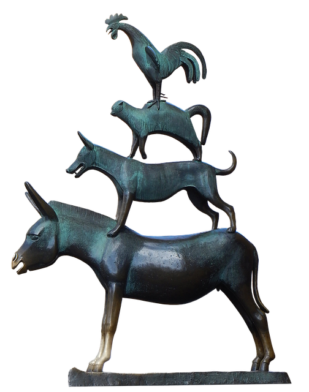

#  Bremen
Bremen is a formal model of music theory written in Coq.  

## Types, functions and theorems
**Letter**  
*Simply the letters from A to G.*
```Coq
Definition eqB (x y : letter) : bool
Definition upward_closer (x : letter) : bool
Definition upward_distance_to_next (x : letter) : nat
Definition next (x : letter) : letter
Definition upward_distance (x y : letter) : nat

Theorem letter1 : forall (x y : letter), (upward_distance x y) = 0 <-> eqB x y.
Theorem letter2 : forall (x y : letter), (upward_distance x y) > 0 <-> ~ (eqB x y).
Theorem letter3 : forall (x y : letter), (upward_distance x y) = 12 - (upward_distance y x).
```

**Pitch Class**  
*Represents a letter with a modifier.*
```Coq
Definition upward_distance (x y : pitchClass) : nat
Definition enharmonic_eq (x y : pitchClass) : Prop
Definition sharpen (x : pitchClass) : pitchClass
Definition flatten (x : pitchClass) : pitchClass

Theorem pitchclass1 : forall (x y : pitchClass), upward_distance x y = 12 - (upward_distance y x).
Theorem pitchclass2 : forall (x y z : pitchClass),
  enharmonic_eq x y <-> upward_distance z x = upward_distance z y.
Theorem pitchclass3 : forall (x : pitchlass), flatten (sharpen x) = x.
Theorem pitchclass4 : forall (x y : pitchlass), sharpen x = y -> flatten y = x.
Theorem pitchclass5 : forall (x y : pitchclass), upward_distance x y + 1 = upward_distance x (sharpen y).

```

**Pitch**  
*Represents the scientific notation of pitch.*  
```Coq
Definition distance (x y : pitch) : Z
Definition enharmonic_eq (x y : pitch) : Prop
Definition halfstep_up (x : pitch) : pitch
Definition wholestep_up (x : pitch) : pitch
Definition apply_upward (p : pitch) (i : intervalName) : pitch

(*similar to distance axioms*)
Theorem pitch1 : forall (x y : pitch), distance x y = 0 -> enharmonix_eq x y.
Theorem pitch2 : forall (x y : pitch), distance x y + distance y x = 0.
Theorem pitch3 : forall (x y z : pitch), distance x z =< distance x y + distance y z.

(*some equality axioms*)
Theorem pitch4 : forall (x : pitch), enharmonic_eq x x.
Theorem pitch5 : forall (x y : pitch), enharmonic_eq x y -> enharmonic_eq y x.
Theorem pitch6 : forall (x y z : pitch), (enharmonic_eq x y) /\ (enharmonic_eq y z) -> enharmonic_eq x z.
Theorem pitch7 : forall (x y : pitch), enharmonic_eq x y -> enharmonic_eq (halfstep_up x) (halfstep_up y).
```

**Interval Quality**  
*Represents minor, major, perfect, diminished, diminished from minor, and all possible others...*  
```Coq
```

**Interval Name**
*Represents all possible interval names.*  
```Coq
Definition enharmoinc_eq (x y : intervalName) : Prop
Definition plus (x y : intervalName) : intervalName
Definition minus (x y : intervalName) : intervalName
Definition invert (x : intervalName) : intervalName

(*some equality axioms*)
Theorem intervalname1 : forall (x : intervalName), enharmonic_eq x x.
Theorem intervalname2 : forall (x y : intervalName), enharmonic_eq x y -> enharmonic_eq y x.
Theorem intervalname3 : forall (x y z : intervalName), (enharmonic_eq x y) /\ (enharmonic_eq y z) -> enharmonic_eq x z.

(*addition axioms*)
(*commutativity*)
Theorem intervalname4 : forall (x y : intervalName), enharmonic_eq (plus x y) (plus y x).
(*associativity*)
Theorem intervalname5 : forall (x y z : intervalName), enharmonic_eq (plus (plus x y) z) (plus (plus y z) x).
(*identity*)
Theorem intervalname6 : forall (x : intervalName), enharmonic_eq x (plus x {Perfect Unison}).
(*inverse ?*)
Theorem intervalname7 : forall (x : intervalName), enharmonic_eq (plus x (minus {Perfect Unison} x) {Perfect Unison}).
(*distribution ?*)

(*some for invert*)
Theorem intervalname8 : forall (x : intervalName), enharmonic_eq x (invert (invert x)).
```
**Interval Structure**
*Represents a list of intervals. (absolute or relative?)*
```Coq
Definition apply_upward_to_pitch (p : pitch) (is : intervalStructure) : chord
Definition apply_upward_to_pitchClass (pc : pitchClass) (is : intervalStructure) : abstractChord
Definition enharmonic_eq (x : intervalStructure) : Prop
```

**Abstract Chord**
*Represents an ordered list of pitch classes, such as a scale or a chord.*  
```Coq
Definition enharmonic_eq (x y : abstractChord) : Prop
Definition invert (x : abstractChord): abstractChord
Definition plus (x y : abstractChord): abstractChord
Definition minus (x y : abstractChord): abstractChord
Definition structure (x : abstractChord): structure
```

**Chord**
*Represents an ordered list of pitches, such as a chord voicing.*  

**Chord Name**
*Represents all the valid chord names.*  


## Kijavítani, megcsinálni
- A bizonyításokban sok helyen enharmoniai egyenlőséget írtam sima egyenlőség helyett.  
- A letterhöz tartozó upward_distance függvényt megírni fixpointtal.
- hangközöknél N helyett P
- README-t frissíteni
- Dokumentáció
- 13 alap zeneelmélet 20 song, római számos analízis, frekvenciák, másik modell 27 állítások bizonyítások
- összevissza notationöket megszüntetni
## Linkek
https://softwarefoundations.cis.upenn.edu/lf-current/Poly.html
