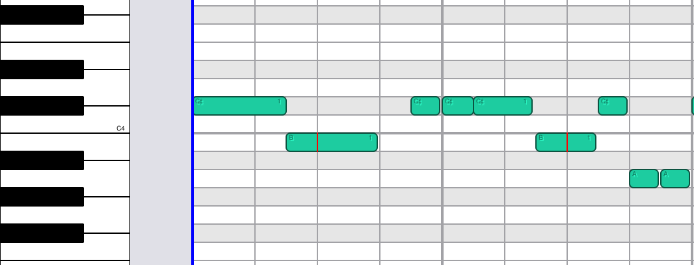
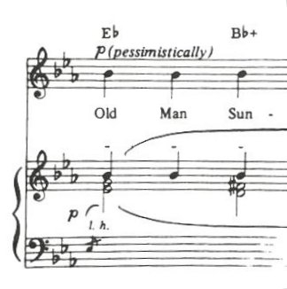
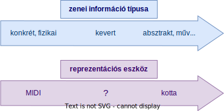
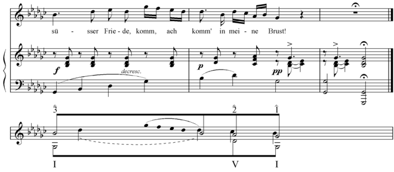
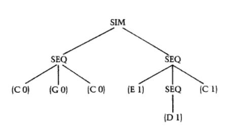
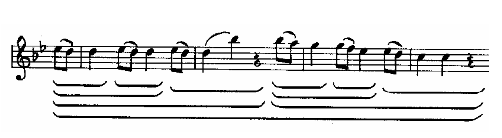
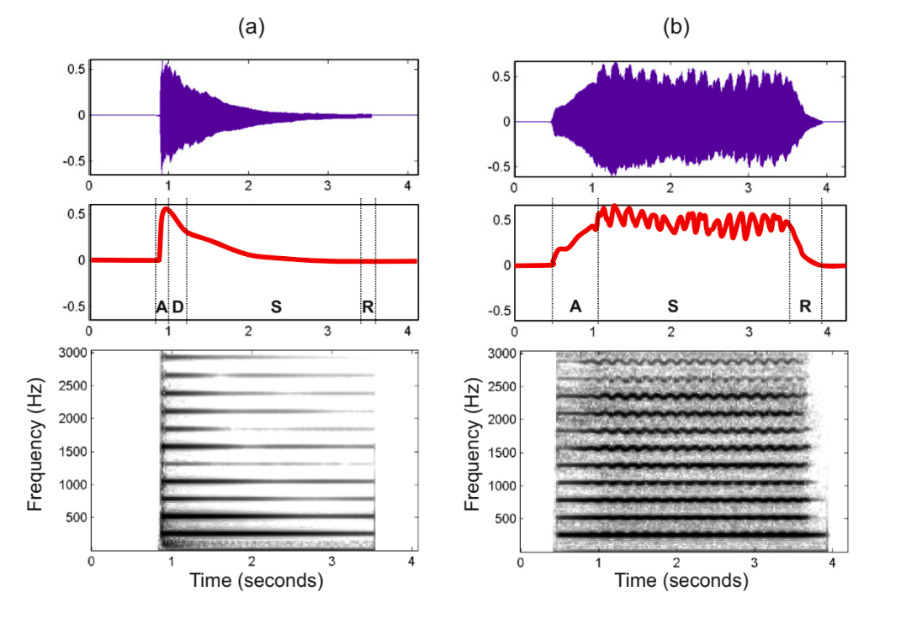

# A könnyűzene formális modellje

## 1. Absztrakt
A zenei jelfeldolgozással foglalkozó algoritmusok gyakran figyelmen kívül hagyják magának a zenének az elméletét. Ennek oka a formális zenei modell hiánya. A munkámban megmutatom, hogy a formalizált zeneelmélet felhasználható a jelfeldolgozási kimenetek gépi elbírálásában. Megvizsgálom, hogy a zenei modell megválasztása hogyan befolyásolja a feldolgozás egyes szintjeit, hogyan lehet segítségükre, és hogyan verifikálhatóak számítógéppel az eredményeik. Arra is kitérek, hogy ez a számítási zenetudományi feladat milyen szoftvertechnológiai kihívásokkal jár, és azok hogyan oldhatóak meg.  

## 2. A kutatási célok meghatározása

A kutatás legfőbb célja megállapítani, hogy milyen eszközökkel lehetséges a zene modelljét formalizálni oly módon, hogy a kész modell könnyen beágyazható legyen zenei jelfeldolgozási feladatokba. Ennek hasznossága illetve szükségessége több szinten megnyilvánul valós projektekben.


*1. ábra: A zenei modell jelfeldolgozási feladatoknál jelentkező hiányának szintjei*

A zenei modell hiánya legalacsonyabb szinten a feladat megfoglamazásánál, a követelmények egyértelmű definiálásánál jelentkezik. A zenei projektekre jellemző, hogy mivel leggyakrabban zenei háttértudással rendelkező fejlesztők készítik azokat, a zenészek által ismert zeneelmélet mentén fogalmaznak, ezek  viszont gyakran pontatlanok tudnak lenni a különböző zenei stílusok különböző fogalmazásai miatt. John Rahn is ebből indul ki a *Logic, Set Theory, Music Theory* [[1]](https://www.jstor.org/stable/40351760) című kutatásában, melyben így fogalmaz: 
>A zeneelméleti irodalom számos veszély áldozatául esett definíciók keveréke, és ami mégrosszabb, olyan "definícióké" amelyek minden létező kifejezésmód közül éppen csak definiálástól állnak távol. Ha csak minden olyan szerző aki nem tud definiálni lekorlátozná magát a "tudod hogy értem" fajta fogalmazásra, minden rendben lenne, de a tévesen definíciónak nevezett állítás, ha komolyan veszik azt, végletekig elrontja saját kontextusát.

Fontos hozzátenni, hogy a művészet központú zeneelmélet nem tekinti céljának a formalizáltságot, ezért alátámasztható, hogy miért hoz meg döntéseket több esetben akár hagyomány alapján is. Ha a zeneelmélet ezen alapvető hiányosságától el is tekintünk, akkor is nehezen található olyan zeneelméleti összefoglaló, ami a hanghullámoktól a zenei formáig és stílusokig egybefüggően tárgyalja a témát, így tehát általánosságban rossz gyakorlat a művészeti zeneelmélet használata követelmények megfogalmazásánál.

```python
def is_enharmonic(note1, note2):
    """Test whether note1 and note2 are enharmonic, i.e. they sound the same."""
```
*1. kódrészlet: "Tudod hogy értem" típusú dokumentáció példa a Mingus nevű, Python zeneelméleti libraryből*

```
Azokat a hangjegyeket, amelyek különböző írásmóddal (különböző betűvel), de ugyanazzal a hangmagassággal rendelkeznek és ugyanaz a billentyű jelöli őket a zongorán, enharmóniailag egyenlőnek nevezzük.
```

*2. kódrészlet: Az első kódrészletben olvasható példa pontosabb definíciója a Berklee Music Theory első kötetéből. Természetesen nem a zeneelmélet függ a zongora billentyűkiosztásától, hanem fordítva.*

A modell szerepe a zenei adatok tárolásában is megjelenik. Dalok reprezentálására két módszert használnak a gyakorlatban, melyek közül az egyik a MIDI fájl. Ennek egyértelmű hátránya, hogy a ritmikai információ kinyerése feldolgozást igényel. Az emögött rejlő ok, hogy a hangok kezdete és vége van csak eltárolva, a hangérték megállíptása pedig sok esetben nem egyértelmű ezek alapján. Minden hanghoz a hang magasságán kívűl még a hang erősségének értéke van feljegyezve. Ennek a számnak az interpretálása szintén nem egyértelmű feladat, hiszen egyszerre fejezi ki a hangszer hangerejét, a hang dinamikáját, a dal adott részének a dinamikáját illetve akár a hang ütemben kapott szerepét is. Ezen indokok miatt a MIDI formátum bár a zene fizikai leírásának megfelelő reprezentáció tud lenni, sok esetben további feldolgozást igényel, így általánosságban véve nem tekinthető magasszintű zenei jelfeldolgozási feladatoknál megfelelő kimeneti formátumnak.



*2. ábra: MIDI fájlok vizualizációs eszközén, piano rollon ábrázolt dallam. Generált fájlok ("gépi zene") esetén könnyen leolvasható a ritmika, azonban élőzenéből kinyert információknál a különböző hangsúlyozási eszközöknek és stílusjegyeknek köszönhetően a hangok kezdete és vége sokkal kevésbé szabályos, ráadásul a rácsvonal, vagyis az ütemérzet sem áll rendelkezésünkre.*

A zeneművek másik reprezentálási formája jellemzően valamilyen kottaszerű ábrázolást jelent. Bár ezen a területen megvalósítás és célkitűzések szempontjából széles skálán mozognak az eszközök, gyakori probléma viszont a jelfeldolgozáshoz való használatukban, hogy nem magát a zenét, hanem a kottát reprezentálják, ez pedig azon felül, hogy szükségtelen komplikációkat okoz, több esetben félrevezeti a fejlesztőket az eredmények értékelésénél, vagy a célok meghatározásában. Erre példaként hozható az ütemmutató és az ütemen belüli hangsúlyozás feljegyzése. Mivel az ütemmutató meghatározza, hogy az adott ütemen belül mely hangokra kerül nagyobb hangsúly, ezeken a hangokon kottában a megfelelő hangsúlyozást külön jelölni felesleges, viszont jelfeldolgozási feladatoknál minden egyes hang pontos hangsúlyozását elhagyni nagymértékű adatkiesést jelentene és nagyban megnehezítené a további feldolgozást. Ezen kívűl a kottába feljegyezhető dinamikai kifejezések gépi értelmezése lehetetlen vállalkozás lenne, ezek nélkül viszont nem megfelelő a zene reprezentálása kottában, így a kotta bár megfelelő végkimeneti formátum magasszintű jelfeldolgozási feladatoknak, a feladat végrehajtása közben viszont rossz gyakorlat a használata. Fontos megjegyezni, hogy léteznek olyan kottaszerű reprezentáló eszközök, amelyek jól kezelnek a most említett nehézségek közül többet is.



*3. ábra: Ahogy a kotta értelmezése, úgy az alacsonyabb szintű reprezentáció kottává alakítása sem egyértelmű feladat, így ez külön problématerületként kezelendő*.



*4. ábra: A reprezentáció szintjei jelfeldolgozási feladatoknál*

Egy általános zenei modellre a jelfeldolgozás során mint függvény gyűjteményre is szükség van. Erre a problémára számos zeneelmélet könyvtár létezik, viszont ezek saját típusokat használnak, amik nehezen kapcsolódnak zenei reprezentációs eszközökhöz. Másik általános hiányosságuk, hogy a fizikai zeneelmélet definícióit nem tartalmazzák.

Legmagasabb szinten pedig a zene formális modellje használható lenne jelfeldolgozó algoritmusok kimenetének zenei kiértékelésére. Bár ez használat szempontjából nem különül el a korábban említett zeneelmélet könyvtár eszközöktől, abból a szempontból fontos elkülöníteni mégis, hogy ez a feladat sokkal magasabb szintű zenei formalizálást igényel. Példaként hozható egy dal részeinek megnevezése, vagy műfajának felismerése.


A modell formalizálásnak eszközének megválasztásán kívül megvizsgálom, azt is, hogy melyek azok a zeneelméleti területek illetve konkrét feladatok amelyeket egy ilyen modellnek tárgyalnia kell annak érdekében, hogy mai jelfeldolgozási feladatokat megfelelően tudjon támogatni.

## 3. A problémakör irodalmának, az előzményének rövid áttekintése

A számítási zenetudomány területén írt kutatásokról elmondható, hogy leggyarkabban egy újfajta zenei analízist mutatnak be, vagy egy már megírt részleteit taglalják. Az elmúlt közel hatvan évben számos olyan analízis illetve ezekhez tartozó feladat akadt, melynek nagy jelentőséget nyilvánított a szakma. Ebben a fejezetben ezek közűl a legelterjedtebb négyet fogom bemutatni röviden és vizsgálni a relevanciáját a könnyűzene formális modelljének jelfeldolgozási feladatokban betöltött szerepének szempontjából, illetve körüljárom, hogy megvalósításuk hogyan lenne lehetséges.

### 3.1. Schenkeri zeneelmélet, generatív grammatika és halmazelmélet

Heinrich Schenker zeneelmélete számos zenei analízis alapjává vált, mivel ez volt az első olyan formálisnak ható rendszer, amellyel meghatározható egy zene felépítése a formától egészen a dallam szintjéig. Lényege abban rejlik, hogy szabályok mentén az eredeti zenét abstract zenei felépítéssé egyszerűsíti, így adva magyarázatot egy adott zenei résznek. Ezek az absztrakt zenei felépítések, hiszen továbbra is zenéről beszélünk, tovább egyszerűsíthetőek. A legmagasabb szintű absztrakt kivonat, az úgynevezett alapvető struktúra (Ursatz) nagyjából megegyezik minden egyes tonális műnél, így ez az elmélet alkalmas arra, hogy megmutassa egy adott zenemű egyedisége milyen szinten lép fel, illetve jól rávilágít két mű közötti különbségre is.



*5. ábra: Felül az eredeti zenemű, alul pedig a belőle schenkeri analízissel megállapított kivonat [[2]](https://en.wikipedia.org/wiki/Schenkerian_analysis)*

Mivel Schenker zeneelmélete átírási szabályokon alapul, nagyon jól kapcsolatba hozható Chomsky transzformációs generatív grammatikájával. Ezen az ötleten alapul Stephen W. Smoliar *A Computational Aid for Schenkerian Analysis* [[3]](https://www.jstor.org/stable/3680082) című cikkje, melyben az említett zenei analízist elvégző program működését részletezi. Ennek megvalósítása során Smoliar felismerte, hogy a Schenkeri zeneelmélet alapvető problémája az aluldefiniáltság, így az csak alapgondolatok ötleteként szolgált a saját zeneelméletének formalizálásában.


*6. ábra: Egy generatív gammatikával felírt mondat*



*7. ábra: Smoliar modelljében faként ábrázolt zene. A SIM az egyszerre megszólalást, a SEQ pedig az adott sorrendben való rákövetkezést jelenti. Érdekesség, hogy ez a zenei modell eltekint a hangok hosszától. [[3]](https://www.jstor.org/stable/3680082)*

Smoliar mellett John Rahn is kutatásában próbát tesz egy formális, de a Schenkeri zeneelmélethez hasonló modell felépítésére. A *Logic, Set Theory, Music Theory* [[1]](https://www.jstor.org/stable/40351760) című cikkében egy kezdetleges modellt épít fel halmazelmélettel, viszont a sorravett definíciókban hamar megjelennek korábban nem definiált zenei kifejezések, melyeket később sem tárgyal.

```
IVA)        x and y are pitch-adjacent IFF x and y are notes whose pitches are a minor, major or augmented second apart.
```

*3. kódrészlet: John Rahn zenei modelljének negyedik definíciója a hangközök felhasználásával definiálja a szomszédosság alapvető fogalmát. Az említett hangközök definíciói nem szerepelnek a cikkben, így nagy fejtörést okoz azok megadása a szomszéd hang fogalma nélkül.*

```
IVC)       x and y are pitch-adjacent with respect to C IFF C is a cyclic ordering of pitch-classes and x and y are notes whose pitches are less than an octave apart and belong to pitch-classes that are adjacent in C.
```

*4. kódrészlet: A szomszédosság fogalmának alternatív definíciója, amely már csak egy hangközre hivatkozik.*

A kutatás arra is kitér, hogy a modell több szintaktikailag helyes, de elkerülendő, "ronda" zenei értelmezést is tud generálni. Ugyanígy "ronda" zeneművek is generálhatóak a modellből, vagy máshogy fogalmazva "nem zenék" is értelmezhetőek vele. Rahn szerint hiábavaló próbálkozás olyan elmélet megalkotásán dolgozni, amivel csak szép zenék és a legszebb elemzések állíthatóak elő.


### 3.2. A tonális zene generatív elmélete (GTTM)

Fred Lerdhal és Ray Jackendoff 1977-es *Toward a Formal Theory of Tonal Music* [[4]](https://www.jstor.org/stable/843480) kutatása új gondolatokat hozott a zene formalizálásának területére. Kitűzték, hogy a zeneelméletnek legalább négy doménje van, névlegesen csoportosító analízis, metrikus analízis, időintervallum redukció, és prolongációs redukció. Ezt a négyest a tonális zene generatív elméletének nevezték el. A modelljükben mind a négy elemzéshez a lehetséges struktúrális leírások meghatározására well-formedness szabályokat, a lehetséges leírások közötti a "tapasztalt hallgatónak" megfelelő leírás kiválasztására pedig preference szabályokat definiáltak. A csoportosító analízis a zenebén szereplő hangcsoportok hierarchiai rendjét adja meg, a metrikus analízis pedig az erős és gyenge ütések rendjét. A prolongációs redukció erősen párhuzamba hozható a Schenkeri zeneelmélettel, céljában megegyezik vele, míg a szabályokat a formalizáltság érdekében ahogy Smoliarnál és Rahnnál is láthattuk, máshogy kényszerűl definiálni. Az időintervallum redukció abban tér el a prolongációs redukciótól, hogy az egyszerűsítést a zene hangcsoportjain értelmezi.

```
GWFR1 Any contiguous sequence of pitch-events, drum beats, or the like can constitute a group, and only contiguous sequences can constitute a group.
GWFR2 A piece constitutes a group.
GWFR3 A group may contain smaller groups.
GWFR4 If a group G1 contains part of a group G2, it must contain all of G2.
```

*5. kódrészlet: A GTTM csoportosító analízisének pár well-formedness szabálya*

```
GPR3 (change) Consider a sequence of four notes, n2-n3 may be heard as a group boundary, if
 - a) register
 - b) dynamics
 - c) articulation
 - d) length
changes.
```

*6. kódrészlet: A GTTM csoportosító analízisének egyik prefrence szabálya.*


*8. ábra: A 6. kódrészletben felsorolt négy eset szemléltetése kottán.*



*9. ábra: A csoportosító analízis eredménye W. A. Mozart 40. szimfoniájának egy részletén.*

### 3.3. Összegzés a könnyűzene és a jelfeldolgozás szemszögéből 

Az említett cikkek jól szemléltetik a tudományág kutatásainak fókuszát. Bármely cikk, amely egy elméletet tárgyal, a tonális klasszikus zenét teszi az analízis mindenkori bemenetévé, bár egyértelmű, hogy sokkal nagyobb számban van szükség könnyűzene elemzésére. Ezt tekintve fontos a kérdés tehát, értelmezhetőek-e a klasszikuszene analítikai módszerei könnyűzenén? Mielőtt ezt a kérdést tovább bontanám, fontos megemlíteni a zenetudósok között egy nagyon elterjedt nézetet, az elemzési partikularizmust. A partikularista zenetudósok nem nyilvánítanak nagy jelentőséget az univerzális zenei elemzéseknek, mert úgy gondolják hogy a zeneművek egyediségéből következik, hogy analítikai eszközeiket is egyedileg kell megválasztani. Ha ezt elfogadjuk, a korábbi kérdés helyett jobb feltenni azt, hogy milyen a könnyűzenére általánosan megállapítható tulajdonság kinyerésére lehet szükség a jelfeldolgozási feladatok során? A korábban bemutatott analíziseknél megfigyelhető, hogy nem fektetnek hangsúlyt az analízis céljának meghatározására, vagyis arra, hogy milyen információ kinyerésének a feladatát valósítja meg, hanem elsősorban lépéseit vázolják. Éppen ezért csak a saját feladatunk pontos célkitűzései után lehet megvizsgálni, hogy a korábbi zeneelméletek közül felhasználható-e valamelyik, azonban formális specifikáció hiján ez igen csak nehéz vállalkozás. *Értelmezhetőek-e akkor a klasszikuszene analítikai módszerei könnyűzenén?* Sajnos a válasz az, hogy bár a használatuknak akadálya nincsen, nem tudhatjuk, hogy az eredmény mit fog jelenteni,  ezért nem biztosan célrevezető a felhasználásuk.

Ugyanennyire fontos, de egyszerűbb kérdés a következő: hogyan használhatóak fel ezek az analízisek zenei jeleken? Természetesen nem egy hatalmas lépésben szeretnénk kinyerni az információt a hanghullámból. A tipikus részfeladatok közé tartozik a különböző transzformációkkal a zenei adat, vagyis a zenei hangok kinyerése. A feladat ezen szintjén amikor zenei hangról beszélünk, igazán egy frekvenciára, egy kezdeti és befejezési időpontra, és különböző dinamikai jellemzőkre gondolunk. Ezeket a primitív zenei hangokat megfelelően tudjuk például MIDI-ben ábrázolni. Ahogy láthattuk az említett cikkek, bár erre külön nem térnek ki, de kottán definiálják az elemzéseket. Ez a gyakorlat elfogadható, lévén céljuk kész zeneművek leirat alapján történő vizsgálata. Ahhoz azonban, hogy ezeket felhasználhassuk jelfeldolgozás során is, a primitív zenei hangokat valahogyan kottába kell szednünk, vagy definiálnunk kell alacsonyabb szintre az eredeti analízisekkel megegyezőeket. Akárhogy is, a kotta és a nem kotta között tátongó lyukat, névlegesen az ütemmutatót, ritmust, hangnemet és hangneveket valahogyan át kell hidalni.


*10. ábra: A hanghullám, a primitív zenei hangok és a kotta is a zenét reprezentálja, mégis különböző információk nyerhetőek ki belőlük.*

A számítási zenetudomány irodalmát összevetve könnyűzenei jelfeldolgozás feladatával elmondható, hogy bár vannak jelentős átfedések, a hiányosságok ennél nagyobbak. A hiány először is az adatok reprezentálásának szintjén jelenik meg. A MIR egyik legfontosabb teendőjének tekinti a zenei adatok megfelelő reprezentálást a következő lépés végrehajtásának érdekében, amíg az említett irodalom megelégszik a kottával. Ezenkívűl a formalizáltság hiányát mutatja az, hogy a zenei analízisek szinte minden esetben implementáció nélkül, gyakran szavakkal megfogalmazott szabályokkal jelennek meg, így nehézzé téve alkalmazásukat valós projektekben. Az irodalom végső hiányossága pedig funkcióbeli. Sok a jelfeldolgozás során felmerülő zeneelméleti problémát nem tárgyal, például a hangok ütembeszedését, mivel ahogy korábban láthattuk ez az alacsonyabb zenei szint nem létezik az irodalomban. Ez a különbség kényszeríti ki azt a zeneelméletet, ami már nem a musicγ, hanem a musicυ elemzésére, tehát a zene, mint leirat helyett a zene, mint hang objektum elemzésére szolgál.

| csatorna          | leírás                  |
| ----------------- | ----------------------- |
| music<sub>ν</sub> | zene, mint koncepció    |
| music<sub>γ</sub> | zene, mint leirat       |
| music<sub>υ</sub> | zene, mint hangobjektum |
| music<sub>φ</sub> | zene, mint érzékelés    |

*11. ábra: A zene Philip Tagg által névlegesített csatornái [[5]](https://www.jstor.org/stable/852975)*

## 4. A téma feldolgozása során alkalmazott módszerek

A munkám legfontosabb célja megállapítani, hogy a zene modellje a lefektetett kritériumoknak megfelelően milyen eszköz használatával formalizálható. A legjelentősebb technológiai kikötés a valós jelfeldolgozási projektekbe való könnyű integrálhatóság. A már létező zenét leíró modellekre jellemző, hogy projekt orientáltak, tehát könnyen bevonhatóak valós feladatokba, viszont ezt leginkább a a formális pontosság feláldozásával érik el, így ebben a fejezetben ebből a két szemszögből nézve határozom meg a megfelelő eszközt a feladatra, példákat mutatva kész modellekből.

### 4.1. Az eszköz megválasztásáról

A (számítási) zenei formalizáltságot sokféle képpen el lehet érni. A megvalósítás eszközei három csoportba sorolhatóak. Az első csoportnak nevezhetjük a fájlkonvenciókat. Ezek alapvető felhasználási területüknek jellemzően a felhasználói programok adattárolását tekinthetjük. Gondolhatunk akár kottaszerkesztő alkalmazásokra, akár zenei perifériák stúdió programokkal való kommunikáicójára, egyes esetekben akár primitív zenelejátszási felhasználásra is, például retró stílusú játékoknál. Ebbe a kategóriába tartozik a kottaszedés formalizálásaként is felfogható MusicXML és Lilypond, illetve a zenei előadás formalizálásaként felfogható MIDI formátum is. Ezeket a már kész modelleket projektbe való bevonás szempontjából vizsgálva megállapítható egyértelműen, hogy alkalmasak rá. Így a kérdés már csak az, hogy megfelelnek-e a mi formális zene követelményeinknek, vagyis tárgyalják-e azokat a területeket, ahol a zenei modell hiánya fellép (lásd 1. ábra).

A fájlkonvenciók, ahogy ez az alábbi kódrészleten látható, ha implicit módon is, de definiálnak zenei kifejezéseket. 

```xml
<?xml version="1.0" encoding="UTF-8"?>
<!DOCTYPE score-partwise
  PUBLIC '-//Recordare//DTD MusicXML 2.0 Partwise//EN'
  'http://www.musicxml.org/dtds/partwise.dtd'>
<score-partwise>
  <work>
    <work-title>Example</work-title>
  </work>
  <!-- ... -->
  <part id="P1">
    <measure number="1">
      <attributes>
        <divisions>4</divisions>
      </attributes>
      <note default-x="129.38" default-y="-20.00">
        <pitch>
          <step>B</step>
          <octave>4</octave>
        </pitch>
        <duration>2</duration>
        <voice>1</voice>
        <type>16th</type>
        <stem>up</stem>
        <beam number="1">begin</beam>
        <beam number="2">begin</beam>
      </note>
    </measure>
    <!-- ... -->
  </part>
  <!-- ... -->
</score-partwise>
```

*7. kódrészlet: A MusicXML modellje szerint, minden mű részekből áll, minden rész pedig ütemekből. Az ütemeken belül hangjegyek szerepelnek, melyekhez hangmagasságon és hosszon kívűl kottaspecifikus vizuális adatok is tartoznak.*

A fájlkonvencióra épülő zenei modellek hiányossága az egyoldalúságukban rejlik. Bár a kotta és a zenei előadás is a zenét írja le, de mégis érezhető, hogy ezek formalizálása nem valósítja meg a zene teljes formalizálását. A korábban említett zenei csatornákat figyelembe véve egyértelmű, hogy a MusicXML és a Lilypond esetében a music<sub>γ</sub>formalizálásról, míg MIDI esetében a music<sub>υ</sub> formalizálásról van szó. Egy optimális modell azonban mind a négy domént tárgyalná és lehetőleg definiálná a közöttük lévő kapcsolatot is. Ez a hiányosság teszi alkalmatlanná ezeknek a zenei modelleknek a jelfeldolgozási feladatokban kizárólagos modellként való használatát. A fájlkonvenciókra továbbá kategorikusan is elmondható, hogy nem fognak tudni zeneelméleti függvénygyűjtemény, illetve a zenei kiértékelés hiányán segíteni lévén nem futtathatóak.

A második kategória a zenei modell megvalósításának eszközeiben a program csomagok. Ezekre jellemző, hogy jelfeldolgozás érdekében készítették őket, így az eddig taglalt követelményeink mindegyikének valahogy megfelelnek. Ilyen eszköz az MIT kutatói által fejlesztett Music21[[6]](https://web.mit.edu/music21/doc/index.html), vagy éppen a Mingus[[7]](https://bspaans.github.io/python-mingus/) nevű python package. A zene négy csatornájára visszatekintve felvetődik a kérdés, vajon tárgyalják-e ezek az eszközök mindegyiket. Általánosan megfigyelhető, hogy valamilyen kevert modellt állítanak fel, ami bár nagyon szoros kapcsolatban áll a kottával, vagyis a tiszta zenei leirattal, de emellé beemelnek tulajdonságokat a zene jobban fizikai oldaláról is. Ez a gyakorlat felfogható a zenei leirat egy alacsonyabb, a kottához viszonyítva hiperrealisztikus szintjének.

```python
class Microtone(prebase.ProtoM21Object, SlottedObjectMixin):
    '''
    The Microtone object defines a pitch transformation above or below a
    standard Pitch and its Accidental.
    >>> m = pitch.Microtone(20)
    >>> m.cents
    20
    '''
```

*8. kódrészlet: A Music21 a zenei hangmagasságok általános definícióját úgy bővítette ki, hogy az adott hangmagasságok a tisztától való eltérését is meg lehessen adni.*

Bár a Music21, mint legjobb zeneelméleti programcsomag is több szinten hiányos, például a zene alacsony (fizikai) és magas (formai) szintjén, illetve az irodalomhoz hűen a tonális klasszikus zenét teszi egyenlővé a zenével, de bővíthetőségének köszönhetően ezek pótolhatóak lennének, így kategorikusan a programcsomag, mint technológiai megvalósítása a zenei modellnek nem utasítható el ezek alapján. Így a kérdés jelen technológiánál már csak az, hogy mennyire tekinthetó jó formális definíciónak egy Python függvény. Vegyük az alábbi példát:

```python
    def transposePitch(self, p, *, inPlace=False):
        '''
        transpose a pitch, retaining the accidental if any.
        >>> aPitch = pitch.Pitch('g4')
        >>> genericFifth = interval.GenericInterval(5)
        >>> bPitch = genericFifth.transposePitch(aPitch)
        >>> bPitch
        <music21.pitch.Pitch D5>
        If inPlace is True then applied to the current pitch:
        >>> gPitch = pitch.Pitch('g4')
        >>> genericFifth = interval.GenericInterval(5)
        >>> genericFifth.transposePitch(gPitch, inPlace=True)
        >>> gPitch
        <music21.pitch.Pitch D5>
        A generic interval transformation retains accidentals:
        >>> a2 = pitch.Pitch('B-')
        >>> cPitch = genericFifth.transposePitch(a2)
        >>> cPitch
        <music21.pitch.Pitch F->
        >>> a2.octave == cPitch.octave
        True
        Can be done inPlace as well, in which case, nothing is returned:
        >>> gSharp = pitch.Pitch('g#4')
        >>> genericFifth = interval.GenericInterval(5)
        >>> genericFifth.transposePitch(gSharp, inPlace=True)
        >>> gSharp
        <music21.pitch.Pitch D#5>
        '''
        if p.octave is None:
            useImplicitOctave = True
        else:
            useImplicitOctave = False
        pitchDNN = p.diatonicNoteNum

        if inPlace:
            newPitch = p
        else:
            newPitch = copy.deepcopy(p)

        newPitch.diatonicNoteNum = pitchDNN + self.staffDistance
        if useImplicitOctave is True:
            newPitch.octave = None

        if not inPlace:
            return newPitch
```

*9. kódrészlet: Music21-ben a hangmagasságokra értelmezett hangközzel való transzponálás függvénye*

A kódrészleten olvasható függvény szépen dokumentált és kellően egyszerű ahhoz, hogy a kódot egy átfutással is megértsük, így könnyen észrevehető, hogy `transposePitch()` nem csak annyit tud, amennyit a neve elárul. Először is választhatunk, hogy a megadott hangmagasságot módosítsa, vagy egy új példányt adjon vissza, másodszor pedig a függvény alkalmazható olyan hangmagasságokra is, amelyek oktávja (vagyis a pontos helyük) nincs is megadva. Általánosságban ezek a plusz lehetőségek tesznek egy jó függvénygyűjtemény programcsomagot könnyen használhatóvá, azonban egy modell leírása szempontjából ezek éppen nehézségeket okoznak. A zenei modellben nem csak függvényeknek kell szerepelniük, hanem azok tulajdonságaiknak és más rájuk vonatkozó állításoknak is. A példán látható módon megfogalmazott definícióra állításokat megadni szükségtelenül bonyolult lenne, azonban csak az állítások megadása miatt egy egyszerűbben felírt `transposePitch()` függvény nem használná ki a Python, vagy általánosságban az imperatív nyelvek által nyújtott lehetőségeket. Programcsomagok azonban léteznek funkcionális nyelvekhez is, melyekben természetesebbek lennének a funkciók szempontjából egyoldalúbb és lényegretörőbb definíciók.

```coq
Definition apply_to_pitch (p : pitch) (i : intervalName) : pitch := 
  match p, i with
  | l # m ' o , iname q n =>
    match apply_to_pitch_class (l # m) (iname q n) with
    | l2 # m2 => l2 # m2 ' o + (Nat.div n 7) + 
      match between_pitches (l # m ' o) (l2 # m2 ' o) with
      | upward x   => 0
      | downward (iname q 1) => 0
      | downward _ => 1
      end
    end
  end.
```

*10. kódrészlet: A hangközzel való hangmagasságokon értelmezett transzponálás funkcionális definíciója*

A harmadik kategória a zenei modell megvalósításának eszközei között funkcionális nyelvek vonálon továbbhaladva a proof assistant programcsomagok kategóriája. Ezek az eszközök a funkciónális nyelveken felírható bizonyítások megoldására szánt "bizonyítási nyelvvel" való kibővítését jelentik. Ezek közül a két legelterjedtebb eszköz az Agda illetve a Coq. Jelenleg egyik nyelvhez sem létezik komoly zeneelméleti könyvtár, azonban megállapítható, hogy formalizálás szempontjából minden korábbi követelményünk megvalósítására megfelelőek lennének. Egy proof assistantben megírt zenei modellben a zene minden szintjén megfelelően felírhatóak lennének a definíciók, továbbá egyszerűen megfogalmazhatóak lennének a hipotézisek, melyek bizonyításához ráadásul elegendő a papíron megszokotthoz hasonlóan a bizonyítás vázlatát, nem pedig a bizonyító függvényt megadni.

Belátva, hogy zenei formalizálás szempontjából a proof assistant programcsomag megfelel minden kritériumunknak, térjünk vissza az eszköz megválasztásának projektekbe való integrálásának szempontjához. Eddig nem volt szükséges pontosan definiálni ennek kikötéseit, de összegezve alapvetően három szempontból kell jól szerepelnie egy eszköznek, hogy használható legyen valós projektekben. Először is bevonható kell, hogy legyen azokba a nyelvekbe, amelyeken a zenei jelfeldolgozás projektjei tipikusan íródnak. Másodszor lehetőleg minél gyorsabbnak kell lennie (a konkrét zenei feladatok elvégzésében), hiszen zenei jelfeldolgozási projektek nem ritka követelménye a valósidejűség. Harmadikként pedig preferálandó egy olyan eszköz, melynek használata nem áll túl messze a területen dolgozó tipikus fejlesztőktől, mivel ahogy a legtöbb programcsomagnál, itt is a minőség egyik mutatója a projekt életbenmaradása és dinamikus fejlődése, ami egyetemi kutatócsoportot vagy opensource projektet tekintve a fejlesztők cserélődése miatt a minél kevésbé meredek betanulási görbével érhető csak el.

Mielőtt az Agda és a Coq, mint a két legelterjedtebb proof assistant különbségeit a felsorolt szempontok szerint áttekintenénk, fontos megemlíteni a hasonlóságaikat is. Mindkét nyelvben a matematikai bizonyítások és a programkód közötti kapcsolatot a Curry-Howard izomorfizmus valósítja meg, mely röviden annyit jelent, hogy egy függvény felfogható bizonyításként is. Az alábbi példa ezt szemlélteti. Mindkét nyelv Martin Löf függő típusos elméletén alapul melynek célja a konstruktív matematikai felépítést támogatni.

```coq
plus_comm =
fun n m : nat =>
nat_ind (fun n0 : nat => n0 + m = m + n0)
  (plus_n_0 m)
  (fun (y : nat) (H : y + m = m + y) =>
   eq_ind (S (m + y))
     (fun n0 : nat => S (y + m) = n0)
     (f_equal S H)
     (m + S y)
     (plus_n_Sm m y)) n
     : forall n m : nat, n + m = m + n
```

*11. kódrészlet: A természetes számok összeadásának kommutatív tulajdonságának bizonyítása Coq nyelven*

A két eszköz közötti legnagyobb használatbeli különbség, hogy míg Coqban a bizonyítás vázlatának írására definiálva van egy külön nyelv, az úgy nevezett "taktikák nyelve", addig Agdában erre nincs külön eszköz. Bár általánosságban elmondható, hogy a szintaxis kifejezetten nem számít, a korábban felsorolt harmadik technológiai kritérium miatt mégis érdemes megemlíteni, hogy míg az Agda Haskell szerű szintaxist nyújt, addig a Coq egy elsőre szokatlanabb formátummal bír. Mindkét nyelven valamilyen szinten interaktív a fejlesztés folyamata. A Coqhoz tartozó CoqIDE soronként interpretálja a programkódot, míg Agdában egy sokkal magasabb szintű, parancsokon alapuló interakciós felület használható, melyet Emacs bővítményként szolgáltatnak. A projektebe való integrálhatóság szempontjából legjelentősebb különbség azonban a kód extraktálása más nyelvbe. Coqban lehetőség van OCaml vagy Haskell kód exportálására, míg az Agda nem támogatja ezt a funkciót. Végül ez az utolsó különbség az, ami miatt valószínüleg jobb döntés a Coqot választani a zenei modell formalizálásához jelfeldolgozási feladatoknál. A feladatomat tehát egy Coq libraryvel fogom megoldani. 

### 4.2. Definíciók

A modell leírására Coq definíciókat, állításokat és bizonyításokat használok fel. A tesztelést oly módon valósítom meg, hogy a definíciókról tulajdonságokat fogalmazok meg állításként, melyeket adott értékekre bebizonyítok. Ez a gyakorlat párhuzamba hozható a unit teszteléssel. Több esetben az állításokat általánosan is megfogalmazom. Az ilyen általános tulajdonságok belátása a unittesztelésnél egy sokkal erősebb eszköz. Ezekkel azonban elsődleges célom nem a megfelelő működés bebiztosítása (hiszen nem is létezik egy sablonként használható modell), hanem egy szép elmélet felépítése, melynek mozgatórugója a matematikáéhoz hasonló összefüggések sokasága. Szemelőtt tartom tehát John Rahn gondolatát, miszerint "a formalizálásnak épp úgy vonzó az esztétikus döntés, mint a praktikus".


## 5. A téma feldolgozásának részletezése, részletes ismertetése

**a felépítést még át kell gondolni**
A munkám céljai között korábban kitűztem, hogy az eszköznek négy szinten kell támogatnia a zenei jelfeldolgozást. Ebben a fejezetben kitérek rá, hogy egyes szinteken ez hogyan valósul meg, illetve ezt egyszerű példákon szemléltetem is. A fejezet egyszerre zenei modell reprezentációs szintjein keresztül vezet végig a zenei modell hiányának szintjein.

[modell szintjei megint]()

A következőkben taglalt Coq library neve Bremen lett.

[brémai muzsikusok]()

### A zenei hang formalizálásáról

Korábban már említettem, hogy a számítási zenetudomány irodalma jellemzően nem részletezi a zenei hang reprezentálását, hanem ehelyett a kottára támaszkodva épít fel elméleteket. Elvétve azonban mégis lehet találni pár elgondolást a hang tulajdonságairól. Azokat a zenei kifejezéseket, amelyek használata nem egységes az irodalomban az egyértelműség kedvéért a továbbiakban angolul használom.

| angol        | magyar                | angol műszótár szerint [hiv]()   | magyar műszótár szerint [hiv]() |
|-------------|----------------------|-------------------|---|
| pitch        | hangmagasság          | A hang magassága vagy mélysége            | A hangnak az a sajátossága, ami a hangot előidéző rezgések számától függ |
| note         | hangjegy              | A zene lejegyzésére használt szimbólumok  | A hangok magasságának és viszonylagos időtartamának jelölésére és megrögzítésére szolgáló különleges írásjelek |
| register     | regiszter             | Különböző részei egy hangszer vagy énekhang hangterjedelmének  | |
| pitch class  |                      |                   ||

Az alábbi két példa John Rahn modelljének első definíciója, illetve S. W. Smoliar megjegyzése saját modelljéről.

```
x is a note IFF x = <z, <T1, T2>> for some value of z, T1, T2.

Ahol z egy hangmagasság, T1 a hang kezdeti, T2 pedig a befejezési időpontja, úgy, hogy a nulla időpont a megfontolás alatt álló mű kezdetét jelöli egy tetszőleges vagy képzeletbeli előadás során.
```

```
A note két elemből álló listaként van reprezentálva, ezek a pitch és a register. [...] A pitch továbbá lehet diatonikus vagy kromatikus. A diatonikus pitcheket a C, D, E, F, G, A, B szimbólumok reprezentálják. A kromatikus pitchet egy két elemű lista reprezentálja, melynek első eleme egy módosítójel, második eleme pedig egy pitch.
```

A példákból láthatjuk, hogy a definíciók nem egyeznek meg egymással, sőt a szavak általánosan elfogadott jelentésétől is eltérnek. John Rahn esetében a problémát az jelenti, hogy a note időbeliségét nem a ritmika mentén, tehát egymáshoz viszonyított hosszuk alapján, hanem egy művön belüli abszolút elhelyezés szerint határozza meg. Hiányossága pedig, hogy a pitch definiálására nem tér ki, ez azonban Smoliar munkájából kiderül, hogy nem is teljesen egyértelmű feladat. Smoliar modelljében zenei kifejezések átnevezeését, vagy méginkább félrenevezését tapasztalhatjuk. Láthatóan a tudományos pitch lejegyzéshez (SPN) hasonlóan szeretne definiálni dolgokat, leegyszerűsítve betűk, módosítójelek és számok segítségével (például C##3), azonban a helyes pitch kifejezés helyett noteként hivatkozik erre. A leírását kijavítani teljesen úgy lehet, hogy az eredetileg pitchként elnevezett fogalmat pitch classre kereszteljük, mely éppen azt jelenti, amit a megadott definíció is. A pitch class ílymódon való megadásának a számítást a továbbiakban jelentősen bonyolító hibája, hogy felírhatóak `[# , [b , [# , A]]]` formájú felesleges kifejezések is. Smoliar modellje tehát nem tartalmaz a note jelentésének megfelelő formalizációt, így az időbeliséget ebben az elméletben csak a rákövetkezés fejezi ki.

Ezek alapján a helyes formalizáció a Bremenben a pitch szintjéig a következő:

```coq
(* harmony.Letter.v *)
Inductive letter : Type := | A | B | C | D | E | F | G.

(* harmony.PitchClass.v *)
Inductive pitchClass : Type :=
  pitch_class : letter -> Z -> pitchClass.

Notation "L # M" := (pitch_class L M) (at level 80, right associativity).

(* harmony.Pitch.v *)
Inductive pitch : Set :=
  p : pitchClass -> nat -> pitch.

Notation "PC ' O" := (p PC O) (at level 85, right associativity).

Example C1  := (C # 0)   ' 1.
Example Gbb4 := (G # - 2) ' 4.
```

Ez a reprezentálás egyértelműen (és helyesen) különíti el a szinteket és megfeleltethető az SPN-nek azzal a különbséggel, hogy a módosítójelek, mivel azok szintaktikai cukorként is felfoghatóak, nem képezik részét a reprezentációnak, hanem helyettük a módosítás mértékét egy egész szám jelöli, ahol a pozitív a keresztek és a negatív a bék irányát mutatja, így elkerülve a szabálytalan pitchek lejegyzését.

Az eddigi formalizálás megfelel a zenei szótáraknak, azonban ez a párhuzam a note szintjén elkezd szétválni. Ennek oka, hogy a note a kottához kötött dolog, azonban egy optimális zenei modell a zene minden csatornáját magában foglalná, melyek közül a zenei lejegyzés, a kotta csak az egyik. A musicυ (zene, mint hangobjektum) formalizáláshoz való közelítés egyik lehetséges formája minél több fizikai tulajdonsággal ellátni a note-ot. Vegyük az alábbi típust:

```coq
(* harmony.Note.v *)
Inductive note : Type :=
  | note_of : pitch -> duration -> dynamic -> note
  | rest_of : duration -> dynamic -> note.
```

Hogy a szünet a note részét képezi nem szép ezen a szinten, viszont a későbbi definíciók így esztétikusabban alakulnak. Ezt a gyakorlatot láthatjuk John Rahnnál és a Music21-ben is. A duration a zenei hosszúságot reprezentáló típus, melyre később kitérek. A dynamic a note dinamikai tulajdonságát írja le. Ez több féle képpen is definiálható, attól függően, hogy milyen részletességel szeretnénk a zenéről beszélni. Például jelfeldolgozási feladatoknál tudjuk pontosan azokat a fizikai attribútumokat használni, amelyeket az adott transzformációkkal meg tudunk állapítani, de tetszés szerint le tudjuk szűkíteni kottára jellemző kifejezésekre is. Ezt szemlélteti a két leegyszerűsített példa.

```coq
(* represents starting, middle and ending velocity *)
Inductive dynamic : Type :=
  dyn : nat -> nat -> nat -> dynamic.
```

```coq
Inductive dynamic : Type :=
| f
| mf
| mp
| p .
```

Note és a pitch különválasztásának köszönhetően definiálhatjuk zenei hangok időtől elvont struktúrját is. Ezzel a felépítéssel akkordokat és skálákat is reprezentálhatunk, így általános elnevezésnek a Chord szót választottam. Ezekről a zenei felépítésekről a zeneelmélet gyakran még általánosabban, az időn kívűl a hang magasságának regiszterbeli tulajdonságától is eltekintve beszél és hoz állításokat. Az ilyen típusú definíciók is könnyen megadhatóak a pitch és a pitch class különválasztásának köszönhetően a Chordhoz hasonlóan felépíthető AbstractChord típussal.

```coq
chord
abstractchord
```

A bemutatott típusokra számos állítás definiálható, melyeket alapvetően elvárnánk, hogy egy zenei modellben teljesüljenek. Ahogy láthattuk, előfordul azonban, hogy olyan dolog reprezentálására kényszerülünk, melyről nem olvastunk még korábban, így hasonlítási alapunk sincsen, így összesen a praktikusság és az esztétika az amire támaszkodhatunk.

```coq
bizonyítás
```

A zenei jelfeldolgozási feladatok megvalósításának első nehézsége, ami a modell hiányából adódik, az a formális követelmények elmaradása, illetve a fejlesztői dokumentáció pontatlan megírása. Ezeknél a feladatoknál akár egy zeneelméleti programcsomag definícióihoz, akár egy zenei műszótárhoz igazodunk, nagyon könnyen találhatunk hibásan, vagy aluldefiniált részeket, amelyek legrosszabb esetben csak a program megvalósítása utána a tesztelésnél jelentkeznek. Ilyen helyzetekben a fejlesztő mindenképpen rosszul jár, hiszen azt kell eldöntenie, hogy elfogadja-e a modell nem megfelelő formalizálását, amin a már kész jelfeldolgozás alapszik, vagy nem. Tekintsük az alábbi példát. **.....**

[példa, mingus hangközeit felhasználva?]()

Ebben az esetben a Bremen választásához mérlegelni kell, hogy az említett problémák kiküszöbölésének érdekében megéri-e az új technológia megismerésébe fektetett energia. Egyetemi kutatócsoportokat szemelőtt tartva elmondható, hogy igen. Muszáj utoljára még egyszer feltenni a kérdést, vajon megoldjuk-e egy ilyen eszköz használatával általánosságban az összen ilyen jellegű problémát? Azt feltehetjük, hogy a rendszer formálisan megfelelően definiált, állításokkal és (Coq által elfogadott) bizonyításokkal teleírt, így az imperatív programcsomagokhoz képest mindenképpen megfelelőbb eredményre számíthatunk ezen a téren. Tudjuk tehát, hogy egy formális zenei modellről van szó, de az viszont megfontolandó dolog, hogy ez a modell megfelel-e zenei szempontból, tehát azt fejezei-e ki, amit elvárnánk tőle. Ezen döntés mellett a területen tapasztalható zenei modell konszenzusának hiányában az egyetlen érv éppen csak a korábban olvasható törekvések listája tud lenni. Ha elfogadjuk tehát, hogy a Bremen egy "jó" zeneelmélet, az alapján, hogy éppen erre törekszik, akkor viszont már rendet tudunk rakni az összes többi zenei definíció és modell között.

```coq
mingus rossz definíció
```

**képezés a frekvenciákba,
követelményeknél nem lehet egy az egybe a coqot használni, de coqban le lehet írni állításokatt a zenei kifejezésekre, ezekre lehet hivatkozni a követelményekben.
**

### A ritmus formalizálásáról

A ritmus a zenei műszótár szerint a hangok időbeli sorrendjének rendje, egymáshoz való időértékviszonya. Ennek megfelelően vegyük az alábbi formalizációt:

```coq
(* rhythm.Division.v *)

Inductive division : Type :=
    | whole
    | half : division -> division
    | third : division -> division
  .
```

```coq
(* rhythm.Duration.v *)

Inductive duration : Type :=
  | dur : division -> duration
  | tie : duration -> duration -> duration.
```

A hangok hosszának egymáshoz való viszonyításának eszköze a duration, vagyis a hossz típusa, mely a division, vagyis a leosztás segítégével épül fel. A ritmus tehát a hosszok listáját jelenti. A leosztás elméletileg bármilyen prímszámmal megtörténhet, például öttel a pentola esetén, ettől azonban eltekintek az eszköz jelen állapotában, mivel ezek a könnyűzenében aligha fordulnak elő.

[negyedhang képen és coqban, stb.]()
[egy dallam, beirogatva a durationökkel és divisionökkel]()

Bár egy dallam nem más, mint hangjegyek listája, a számítási zenetudomány területén megalkotott dallam analízisek között bőven léteznek olyanok, amelyek pusztán hangjegyek listáján, az ütemekbe tördeltség hiánya miatt még sem értelmezhetőek. Az ütemvonal a kottában egy elválasztó eszköz, mely amellett, hogy segít a kottán belüli tájékozódásban, a zene hangsúlyozását fejezei ki, az ütemekhez tartozó ütemmutató pedig az ütem hosszát illetve az ütem alapvető felosztási egységét adja meg. Mivel a zenei jelfeldolgozás során kezdetben a zenei információt MIDI szerüen, tehát időben elhelyezett hangmagasságokként tudjuk kinyerni, ahhoz, hogy például a Schenkeri zeneelméleten alapuló valamelyik formális elemzést alkalmazni tudjuk, muszáj ütemekbe tördelni a hangokat. Ez a feladat tekinthető jelfeldolgozási számítási zenetudomány legfontosabb problémájának.

Az ütem és a zene kapcsolatát elemezve számos megfigyelést tehetünk. Először is, a zene formai részei, mint például versszak és refrén, leggyakrabban egy ütem végéig tartanak és egy ütem elején kezdődnek.

[kotta]()

Az akkordváltások szintén leggyakrabban ütem elején, vagy közepén történnek.

[kotta]()

Gyakran ritmikailag szimmetrikusan épülnek fel az ütemek.

[kotta]()

Nem utolsó sorban pedig gyakran ritmikailag és dallamilag is párhuzam vonható két ütem között.

[kotta]()

Ezek mentén tehát elképzelhető egy hangjegyek listáján értelmezett ütembe tördelő analízis, amely sok esetben megfelelően működne, főleg ha figyelembe vesszük, hogy ezek a tulajdonságok minden egyes hangszer szólamában külön külön előfordulnak és ezek nem mindig esnek egybe, viszont az ütemeknek egybe kell esniük a teljes dalon minden hangszeren. Ez egyértelműen nem tudna minden esetben jól működni, de nem kizárt, hogy elég jól működne ahhoz, hogy eredményesen segítse a további zenei analízist, ezért az ütembetördelés ezenfajta megvalósítása további kutatást igényel. Az azonban belátható, hogy egy ilyen megvalósításnak a Coq nem is lenne a legjobb technológiai választás, ráadásul állításokat sem tudnánk megfogalmazni a feladat és a megvalósítás között. Egy másik megoldás utáni keresés utolsó indokaként pedig tekintsük a GTTM csoportosító analízisének szabályait. Látható, hogy a prefrencia szabályok ugyanazokat a szempontokat részesítik előnyben, amelyeket mi is előnyben részesítenénk az ütemvonalak behúzására, azonban a csoportosító analízis célja nem az ütemek meghatározása, hanem az értelmileg összefüggő egységek határainak megkeresése, ami a példából látszik, hogy előfordul, hogy nem esik egybe.

[dia hetedik sor 5, 6 szabály]()
[dia 6. oldal kotta]()

Felmerül a kérdés, hogy mit is jelent akkor igazán az ütem? A műszótár úgy fogalmazza meg, hogy az ütem az a metrikus egység, ami mindig két főhangsúly (úgynevezett egy) közé esik. A főhangsúlyt egyéb definíció hiányában a legnagyobb hangsúlyok kategóriájának tekintve az ütemvonal jelentése nem más, mint a rákövetkező hangjegy erős hangsúlyozása. Ennek mentén könnyen definiálható egy dallamra az ütemekké tördelő analízis, hiszen egyszerűen szét kell választani minden olyan hangjegy előtt, amely rendelkezik az "egy érzettel", vagyis főhangsúlyos.

```coq
Inductive dynamic : Type :=
| oneFeel
(* ... *) 
.
```

**Ezt a bekezdést kicsit újrafogalmazni**
Érezhető, hogy ezzel a lépéssel inkább csak egy lejjebbi szintre toltuk a problémát, mintsem megoldottuk. A kérdés most már hogy hogyan ismerhető fel a főhangsúly? A zenei hangsúlyozás négy eszköze közül leggyakoribb dinamikai kiemelés, ami nem más, mint a hang nagyobb hangerővel való megszólaltatása. A hangsúly második formája a harmóniai kiemelés, vagyis egy erőteljes akkord is képes jelölni a főhangsúlyt. A hangsúly ezen formájától egyelőre tekintsünk el a harmóniai erőteljesség nehézkes definiálása miatt. A hangsúlyt ki lehet fejezni a hang enyhe meghosszabbításával, vagy késleltetett kezdésével is. Ezeket általánosan ritmikai hangsúlynak nevezzük, azonban ezek a hangjegyek felfogott ritmikáját nem befolyásolják így a ritmikai változtatás lejegyzésre sem kerülhet. A hangsúlyozás negyedik eszköze a könnyűzenében soha elő nem forduló dallami hangsúlyozás, melynek alkalmazásakor a hangsúlyos hangnak enyhén megváltozik a magassága. A hangsúlyozás eszközei közül tehát a dinamikai és ritmikai hangsúlyt érdemes figyelembe vennünk a főhangsúlyok megállapításánál, azonban ennek formalizálása nem a lejegyzés szintjén  jelenik meg, mivel ez a hangobjektum egy attribútuma. Az alábbi definíció a későbbiekben ismertetett transcription típuson adja meg, hogy a kapott zenei leirat az ütemmutatók szempontjából megfelel-e az eredeti hangobjektumnak.

```coq
TRANSCRIPTION is_right ból csak az ütemmutatóra vonatkozó rész
```

**Az ütemmutató többi dolga**

**az ütemmutató nem része a zenének, de megállapítható róla
példa: egy ütemmutató algoritmus kiértékel egy hangfájlt, én pedig a modellemmel a hangfájl leiratának birtokában megmondom, hogy jó-e. Végülis egy bizonyítás, de igazán csak egy unit teszt.**

### A többszólamúság formalizálásáról
A zenei modell legmagasabb szintű típusa a Song, vagyis a dal. Egy dal részekből áll, minden rész pedig egy hangszer és egy többszólamú leirat kettőseinek listájából. A többszólamú leiratra, vagyis a HarmonicPartra az egyszerre több hangot kiadni képes hangszerek miatt van szükség. Azt a megfogalmazást válaszottam, miszerint a HarmonicPart, dallamok, tehát MelodicPartok olyan kombinációja, melyben létezik egy kitüntetett fő dallam, és emellé létezhet akárhány mellék dallam, továbbá a mellékdallamok kezdődhetnek később, mint a fődallam, és akármilyen rövidek lehetnek, tehát nem kell kiérniük a HarmonicPart végéig. Ez a reprezentálás megköveteli tehát a többszólamú részek aprólékos szólamokra bontását, amire a kottában nincs szükség, bár lehetséges. Ennek a követelménynek azon kívül nincs jelentőssége, hogy így a reprezentáció közelebb áll ahhoz, ahogy az emberek elgondolják a zenét, bár az időben egymást részlegesen fedő hangok leiratára mindenképpen kellene lennie modellben valamilyen eszköznek. Ez az eszköz a kottában a ritmikai átkötés.

[nagyjon jó kotta példa a harmonicpart többszólamúságára]

[ritmikai átkötésre példa]

A modellben a hangszert, csak mint a zenei hang felharmónikusainak amplitudó arányát módosító tényezőt definiáltam. Ehhez először is meg kell, hogy tudjuk adni pusztán egy hang felharmónikusainak erősségét. Ennek kifejezésére a harmonic_quality szolgál, mellyel az első nyolc érték adható meg, amely legtöbb zenei hang esetében bőven elég.

```coq
(* theories.physics.Instrument.v *)
(* represents the relative strength of the first 8 overtones to the fundamental note *)
Inductive harmonic_quality :=
  harmonics : Q -> Q -> Q -> Q -> Q -> Q -> Q -> Q -> harmonic_quality.
```

Ez azonban még nem elég ahhoz, hogy leírjuk egy hangszer jellegét, mivel különböző frekvencia tartmoányokban különbözően reagálnak a testek, így a hangszerek is. A complex_harmonic_qualityvel frekvencia ablakokra definiálhatjuk a harmóniai tulajdonságokat, így sok minta használatának esetén nagyon pontosan meg tudjuk adni ezt.

[példa a szakdogámból, hogy a hangmagassággal változik a hangszín]



```coq
(* theories.physics.Instrument.v *)
(* represents harmonic samples at given frequencies.
Between the frequency range of two samples, the higher frequency's sample
will be assumed to represent the instruments harmonic quality. *)
(*nem jó, mert a legnagyobb fölött nincs definiálva *)
Inductive complex_harmonic_quality :=
  complex_harmonics : list (Q * harmonic_quality) -> complex_harmonic_quality.
```

Bár jelenleg a további definíciók könnyebb megadása érdekében egy hangszer nem más, mint egy összetett harmóniai tulajdonság, azonban a valóságban ennél tágabb a probléma. Figyelmen kívűl hagytam például, hogy a hangszín függ a hangerőtől, illetve, hogy a legtöbb hangszer megszólaltatható különböző módon különböző hangszíneken, illetve, hogy a hangszer nem csak a  felharmónikusok amplitúdójának kapcsolatát határozza meg, hanem a hang különböző dinamikai tulajdonságait is, például az indítás hirtelenségét, vagy éppen a hang elhalásának függvényét.

[dolgok, amiket nem foglaltam bele a hangszerbe]

### A hangobjektum formalizálásáról

Eddig a zenéről csak mint leiratként fogalmaztunk meg definícókat és állításokat, és bár ezt a leiratot a kottánál jóval közelebb hoztuk a zene fizikai csatornájához a hangjegyek kibővített dinamikai tulajdonságának köszönhetően, azonban a zene, mint hangobjektum ábrázolására ez még sem alkalmas, mivel ritmikai és hangmagassági absztrakciókat tartalmaz. A hangobjektum típusának definiálására éppen azért van szükség, hogy ezeknek az absztrakcióknak a jelentését egy alacsonyabb szinten definiálni tudjuk, így megteremtve a kapcsolatot a **music?** és **music?** között.

[zenei görögbetűk kapcsolata]

A zenei jelfeldolgozás alap feladata ennek a kapcsolatnak a megértése. Az automatikus leiratkészítés nehézségét jól szemlélteti, hogy ennek a folyamatnak a fordítottja, a leirat alapján való zene szintetizálás sem oldható meg tökéletesen. Ennek oka, hogy míg az előadás során a zenész a zene, mint leriat és a zene, mint koncepció birtokában készíti el a zene, mint hangobjektumot, a számítógép nem tudja megérteni a zene jelentését, így a szintetizálás sok esetben hiányos eredményt készít. Ezt megfontolva a gépi leiratkészítés feladata nem más, mint utánozni az "emberi" leiratkészítést, azzal a különbséggel, hogy míg az ember a hangobjektumon kívűl a koncepciót is felhasználja erre a feladatra, a számítógépnek alapvetően a zene megértése nélkül kell leiratoznia azt. Gondoljunk csak arra, hogy míg egy zenész egy akkordot az általa keltett érzés alapján el tud nevezni, valószínüleg a feszültségek érzete alapján, a pontos felrakás ismerete nélkül, addig jelfeldolgozással az akkord csak a hangok pontos meghatározása után nevezhető el, ráadásul sok esetben az elnevezés folyamata sem egyértelmű, mivel egy adott dolgot többféle képpen is képesek vagyunk hallani. Mivel a két folyamat nem egyezik meg, a számítógép és a zenész különböző típusú hibákat tudnak elkövetni, ami nagyban megnehezíti egy gépi kottázás kiértékelését. 

[zenei görögbetűk kapcsolata 2]

[példa a zenész és a gép akkordefelismerésére]

A zenei modellemben definiált hangobjektum továbbra is tartalmaz absztrakciót a hang alapvető fizikai valójához képest, hiszen nem a légnyomás változását reprezentálja az idő múlásával, hanem az adott időintervallumokon vett előforduló légnyomáskülönbségváltozások frekvenciáit. Ez mindenképen előnyös választás, először is, mert a definíciók így nem lesznek szükségtelenül bonyolultak, másodszor pedig azért, mert a két fizikai szint összefüggésében a zenének már nincsen szerepe. Azt azonban fontos megjegyezni, hogy a hangobjektumra vontakozó állításoknál feltételeztem, hogy az csak zenei hangokat tartalmaz, viszont a jelfeldolgozás szempontjából szükséges lenne egy olyan reprezentációs szint is, ahol még létezik zaj és zörej, hogy ezek kapcsolata is formalizálható legyen.

[zene fizikai szintjei: hanghullám, diszkrét ablakok, közöttük a zaj]

A hangobjektum mintákon vett frekvenciák listájaként való ábrázolása a jelfeldolgozás során elkerülhetetlen, hiszen a hanghullámból a hangmagasságok kinyerését egymást követő ablakokon vett valamilyen transzformációval lehet megvalósítani, melynek kimenete az általunk definiált hangobjektummal pont megegyezik. A modell nem veszi figyelembe a minták sűrűségét illetve azok hosszát, de az elmondható, hogy az idősíkról a frekvencia spektrumra való képezés során a nagyobb pontosság érdekében rövidebb ablakokat használnak, mint amire nekünk a zenei definíciók megírása megkövetelne, így az átlagos használat során ez nem fog problémát jelenteni.

```coq
(* theories.physics.Frequency.v *)
Definition frequency := Q.
```

```coq
(* theories.physics.FrequencySample.v *)

(* measured in decibel *)
Definition amplitude := Q.

Inductive frequency_amplitude :=
  freq_amp : frequency -> amplitude -> frequency_amplitude.

Notation "A 'Hz' B 'dB'" := (freq_amp A B) (at level 85, right associativity).

Definition frequency_sample := list frequency_amplitude.
```

```coq
(* theories.physics.SoundingObject.v *)
Definition sampling_rate := N.

Inductive sounding_object : Type :=
  sounding_obj : sampling_rate -> list frequency_sample -> sounding_object.

Example so1 := sounding_obj 10%N [[]; [(5Hz 1.0dB); (10Hz 0.9dB); (15Hz 0.2dB)]].
```

Mivel zenék gép elbírálására sokszor hatalmas mennyiségben van szükség, fontos lenne definiálni a SoundingObjectre egy olyan állítást, amely eldönti, hogy az adott objektum egyáltalán zene-e, ezzel megspórolva a felesleges analíziseket nem zenét tartalmazó hangfájlok esetén. Bár a zeneelmélet elég sok területre kitér, mégis magának a zenének semmilyen általánosan elfogadható és formalizálható definíciója nem létezik.

**IDE ÍRNI**

```coq 
is_music
is_popmusic
```

A SoundingObject és a Song kapcsolatának vizsgálatára bevezettem a leiratot, vagyis a Transcriptiont, melynek két tagja a hangobjektum és a dal. Azt, hogy egy Song megfelelő leirata-e egy SoundingObjectnek, az alábbi módon ellenőrízhetjük.

```coq
(* theories.physics.Transcription.v *)

Definition is_right (t : transcription) : bool :=
  match t with | transcript so song =>
  andb 
  (is_music so) 
  (*nagyjából megegyezik a hossz *)
  (andb (Nat.leb (N.to_nat (song_duration_in_sec song) * 800) (length_in_msec so))
        (Nat.leb ((length_in_msec so) * 800) (N.to_nat (song_duration_in_sec song))))
  end.
(* Teljesülnie kell:
   - ugyanazok a dolgok szólnak időben ugyanott (kb ??)
   - az egyek hangsúlyosabbak, mint a többi dolog
*)
```

Az első pontja az `is_right`-nak eldönti, hogy a hangobjektum mintái a megadott mintavételezési frekvencia alapján nagyjából megegyezik-e a dal átlag bpm értékéből számolt hosszal.

**IDE ÍRNI**

[szép kép arról, hogy az is_right miket csekkol]

### Példa a modell projektekben való használatára

A zenei modell célja, hogy segítse a zenei jelfeldolgozást. Az alábbi példában megmutatom, hogy a korábban említett négy területen hogyan használható a modell a színvonalasabb jelfeldolgozási projekt megvalósításának érdekében. Vegyük az alábbi feladatot.

> Nagy adag adott hangfájl feldolgozását követően különítsük el a zenét tartalmazóak közül azokat, amelyeken végig csak egy trombita játszik, a teljes dal a C2 - Cb4 hangtartományon belül van és nem szerepel benne tritónusz lépés.

A modell hiányának első szintje a követelmények megfogalmazásában jelenik meg. A feladatszövegben számos olyan kifejezés olvasható, amelyek csak háttértudással értelmezhetőek, illetve akad olyan is, amelynek még úgy sem egyértelmű a definíciója. A Coqban megadott zenei modell segítségével az egyszerű zenei kifejezések jelentését könnyen megkereshetjük, 

 - példa paraméterezhető automatikus bizonyításra, amit egy másik program használni tud
 - a modellt lehet végülis szintetizálásra használni, így könnyen előállíthatók algoritmusoknak teszt esetek, amiket könnyű vizsgálni

## Az eredmények összefoglaló értékelése és a levonható következtetések

A kutatásom célja volt megkeresni azt az eszközt, mellyel a zene modelljének formalizálása elvégezhető úgy, hogy az használható legyen valós jelfeldolgozási projektekben,  az összes eddigi formalizáltságbeli hiányt betöltve. Láthattuk, hogy azonban a szakterületre jellemző aluldefiniáltság miatt nem csak az eszköz megválasztása jelent kihívást, hanem a fogalmak elkülöntése és a zeneelmélet a zene minden szintjére való kibővítése is. Ennek a feladatnak a megoldása tehát az űr betöltését jelentené a zenetudományi kutatások és a jelfeldolgozási projektek között, de ezzel együtt szükségszerűen összekötné a művészei zeneelméletet a fizikával illetve a kottát a MIDI-vel is.

[mit mivel köt össze a bremen]

Mivel nagyon széles területen vállal feladatokat a zenei modell és alig van eszköz amire építkezhet, a zenei reprezentáció szemptonjából alacsonyabb szinteken rengeteg munkát ígényel a kidolgozása, hogy alkalmas legyen az igazán fontos szerepeinek betöltésére magasabb szinteken. Ahhoz, hogy komplexebb példákat mutathassak a munkámban tehát szükségem volt a hangjegy és a ritmus megfelelő definiálására, azonban az ezekre épülő struktúrák megfogalmazása ettől még nem bizonyúlt egyértelműnek. Bár magasabb szintek felé haladva nem zárható ki a további fejlesztések igénye,  úgy gondolom, hogy a formalizálás során a legalacsonyabb szinteken megtartottam, hogy a definíciók szépek, szimmetrikusak és praktikusak legyenek, így ezek változtatására a modell további fejlesztése során sem lesz szükség. A Coq, mint modellt leíró eszköz megfelelő választásnak bizonyúlt mivel teljesítette a könnyen olvasható és matematika típusokra épülő definíciók követelményét. A kapott struktúrákra így tényleg teljesülnek azok az állítások, melyeket elvárnánk, hogy teljesüljenek, hiszen nem függenek imperatív nyelvekre jellemző gépi típusoktól. A célkitűzések között nem szerepelt, de az alábbi állításokat Coqban formálisan beláttam.

```coq
(* theories.harmony.Letter.v *)
Lemma upward_distance_xx : forall (x : letter), upward_distance x x = 0.
Lemma upward_distance_0 : forall (x y : letter), (upward_distance x y = 0) <-> (x = y).
Lemma upward_distance_12 : forall (x y : letter), ~ x = y -> (upward_distance x y) = 12 - (upward_distance y x).

(* theories.harmony.PitchClass.v *)
Lemma pitchclass1 : forall (l1 l2 : Letter.letter) (m : Z), l1 = l2 -> (l1 # m) = (l2 # m).
Lemma pitchclass2 : forall (l1 l2 : Letter.letter) (m1 m2 : Z),
  eqb (l1 # m1) (l2 # m2) = false <-> 
  orb (Bool.eqb (Letter.eqb l1 l2) false) (Bool.eqb (Z.eqb m1 m2) false) = true.
Lemma pitchclass3 : forall (x y : pitchClass),
  eqb x y = false <->
  Nat.eqb (upward_distance x y) (12 - (upward_distance y x)) = true.
Lemma pitchclass16 : forall (l1 l2 : Letter.letter) (m1 m2 : Z), 
  upward_distance (l1 # m1) (l2 # m1) = upward_distance (l1 # m2) (l2 # m2).
Theorem pitchclassx : forall (x y z : pitchClass),
  enharmonic_eqb x y = true <-> upward_distance z x = upward_distance z y.
Theorem pitchclass3 : forall (x : pitchlass), flatten (sharpen x) = x.
Theorem pitchclass4 : forall (x y : pitchlass), sharpen x = y -> flatten y = x.
Theorem pitchclass5 : forall (x y : pitchclass), upward_distance x y + 1 = upward_distance x (sharpen y).

(* theories.harmony.Pitch.v *)
(*similar to distance axioms*)
Theorem pitch1 : forall (x y : pitch), distance x y = 0 -> enharmonix_eq x y.
Theorem pitch2 : forall (x y : pitch), distance x y + distance y x = 0.
Theorem pitch3 : forall (x y z : pitch), distance x z =< distance x y + distance y z.

(*some equality axioms*)
Theorem pitch4 : forall (x : pitch), enharmonic_eq x x.
Theorem pitch5 : forall (x y : pitch), enharmonic_eq x y -> enharmonic_eq y x.
Theorem pitch6 : forall (x y z : pitch), (enharmonic_eq x y) /\ (enharmonic_eq y z) -> enharmonic_eq x z.
Theorem pitch7 : forall (x y : pitch), enharmonic_eq x y -> enharmonic_eq (halfstep_up x) (halfstep_up y).

(* theories.harmony.Interval.v *)
(*some equality axioms*)
Theorem intervalname1 : forall (x : intervalName), enharmonic_eq x x.
Theorem intervalname2 : forall (x y : intervalName), enharmonic_eq x y -> enharmonic_eq y x.
Theorem intervalname3 : forall (x y z : intervalName), (enharmonic_eq x y) /\ (enharmonic_eq y z) -> enharmonic_eq x z.

(*addition axioms*)
(*commutativity*)
Theorem intervalname4 : forall (x y : intervalName), enharmonic_eq (plus x y) (plus y x).
(*associativity*)
Theorem intervalname5 : forall (x y z : intervalName), enharmonic_eq (plus (plus x y) z) (plus (plus y z) x).
(*identity*)
Theorem intervalname6 : forall (x : intervalName), enharmonic_eq x (plus x {Perfect Unison}).
(*inverse ?*)
Theorem intervalname7 : forall (x : intervalName), enharmonic_eq (plus x (minus {Perfect Unison} x) {Perfect Unison}).
(*distribution ?*)

(*some for invert*)
Theorem intervalname8 : forall (x : intervalName), enharmonic_eq x (invert (invert x)).
```

Az állítások közül sok magától értetődő, azonban a szakterület irodalmában ezek még kimondásra nem kerültek, így összegyűjtésük és bizonyításuk igazi áttörést jelent a zenei formalizálás felé. Jelentősségüket tovább növeli, hogy ahhoz, hogy magasabb szinten érdekesebb állításokat vizsgálhassunk, az alacsony szintű zenei struktúráknak ezen tulajdonságait kell majd felhasználnunk. A felvázolt zenei modell tehát bőven betölti a jelfeldolgozási feladatok követelményeinél jelentkező aluldefiniáltságot, hiszen olyan zeneelméletet nyújt, amelyen struktúrákat és a struktúrákon bizonyításokat is be lehet hivatkozni, mely azon felül, hogy egyértelműsíti a leírást, a háttértudással nem rendelkező fejlesztőt be is vezeti a zeneelméletbe anélkül, hogy annak a zenével egyáltalán foglalkoznia kellene.

Sokszor esett már szó a zene eltárolásáról, pontosabban annak megfelelő módjának hiányáról. Láthattuk, hogy ez a feladat leginkább azért jelent problémát, mert sem a MIDI, sem a kotta nem pontosan azokat a tulajdonságait reprezentálja a zenének, amelyekre nekünk szükségünk van. Általánosan elmondható, hogy míg a kotta túl absztrakt, és túl sok mindent bíz az interpretálóra, addig a MIDI túl konkrét és kevés dolog állapítható meg belőle feldolgozás nélkül. Az elkészült modellben szereplő Song struktúra a kottától eltér abban, hogy nem használ ütemeket, és ami ennél még fontosabb, hogy egy másik eszközzel, a független szólamokra bontással ad lehetőséget az átfedő hangok leírására. Ezek a változtatások és a hangjegyek tetszőleges részletességgel megadható dinamikai tulajdonsága teszik lehetővé a Song rugalmas használatát a jelfeldolgozás különböző munkafázisaiban.

A modell a zeneelméleti függvénygyűjtemény szerepét is sikeresen betöltötte. Az előrelépés más gyüjteményekhez képest, elsődlegesen az, hogy ezek a függvények megfelelő struktúrákra építenek. Ezen kívűl nagy öröm, hogy egy helyen szerepelnek a fizikai és művészeti definíciók, így téve könnyebbé a közöttük lévő kapcsolat vizsgálatát. Gondolhatnánk azonban a szakirodalom számos analízisére is, mint magasabb szintű függvényekre. Ezek közös modellen feletti implementálása nagyban elősegítené elbírálásukat, összehasonlításukat és természetesen használatukat is. Úgy gondolom, hogy egy ilyenfajta gyűjteménynek is a jövőben alapja tudna lenni az általam leírt formalizáció, amely így akár egy zenei lexikon és irodalmi példatár hibridjeként tudná megkönnyíteni a számítási zenetudományi kutatásokba való bekapcsolódást.

A magasszintű zenei kiértékelés támogatása egy összetett problémának bizonyúlt, melyhez az alacsonyabb szintű problémák megfelelő megoldása ahogy láthattuk elkerülhetetlen. Ennek a fajta kiértékelésnek három kategóriájával is foglalkoztam munkámban. Először is a SoundingObjectről fogalmaztam meg definíciókat, mellyel olyan információk nyerhetők ki a zenéből, amiket általában csak absztraktabb szinten van lehetőségünk megszerezni. Az ilyen kiértékelés nagyban le tudja csökkenteni nagymennyiségű zenei adat feladolgozását, mivel ezek így részlegesen elbírálhatóak a kottaszerű leirat elkészítése nélkül. Másodszor példát mutattam arra, hogyan definiálhatóak a legmagasabb szintű zenei vizsgálatok, mint például a Song ütemmutatójának  megállapítása, felépítési egységeinek elkülönítése, vagy a hangnemének kiszámolása. Az ilyen típusú analízisek sokkal egyértelműebbek, mint a korábban említett Schenkeri zeneelmélet variánsai, hiszen a megfelelő reprezentálásnak köszönhetően nem okoz kérdést, hogy mit és mit nem tudunk a zenéről. Végül pedig a Transcription segítségével összefüggéseket állapítottam meg a Song és a SoundingObject, vagyis a zene absztrakt és konkrét reprezentációi között. Ez a fajtai kiértékelés például a zenei jelfeldolgozási eszközláncolatok minőségbeli ellenőrzőjeként használható fel. Az így megépített rendszer miután automatikusan leiratot készít egy hangfájlból, automatikusan el is tudná bírálni annak helyességét. Ennek hatalmas előnye, hogy nagymennyiségű adat feldolgozása esetén is könnyű az evaluáció, hiszen nincsen szükség emberi beavatkozásra. További előrelépés, hogy ezt a módszert használó jelfeldolgozó programok helyességének megállapításánál nincsen szükség a várt kimenet ismeretére sem, tehát a bemeneti adatbázis összeállítása elhagyható feladat. Ezeknek az eredményeknek köszönhetően dinamikusabban, kevesebb idő alatt építhető nagy jelfeldolgozó rendszer, illetve könnyebben értékelhetőek adott transzformációk és részfeladatok közötti viszony.


**coq hogy teljesít**

**lezárás**

Toward a formal theory 2. oldal "One of the virtues of formal theory ..."

Az elmúlt években azonban robbanásszerűen növekedett a zenei jelfeldolgozás alkalmazása. Megjelent a streaming szolgáltatóknál és a zenei megosztó felületeken is, megbízható működésüknek szükségét pedig mi sem fejezné ki jobban, mint hogy eredményeik gyakran jogi következményeket vonnak maguk után. 

# hivatkozások

- [1] John Rahn - Logic, Set Theory, Music Theory https://www.jstor.org/stable/40351760
- Tagg - Analysing Popular Music: Theory, Method and Practice https://www.jstor.org/stable/852975

- Smoliar - A Computer Aid for Schenkerian Analysis https://www.jstor.org/stable/3680082
