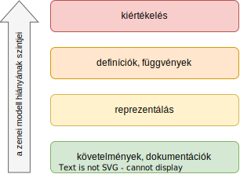
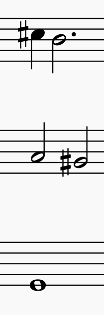

# A könnyűzene formális modellje

**Köszönetnyilvánítás**

Különleges élmény volt, hogy szinte a mesterképzésem teljes időtartama alatt a frissen alakult Research for Understanding Music, Beat and Acoustics kutatócsoport keretein belül elmélyülhettem ebben az érdekes interdiszciplináris kutatási területben, a számítási zenetudományban. Nagy hálával kívánok ezért további lelkes tagokat és megannyi diplomamunkát másodszoros témavezetőmnek, Gera Zoltánnak.

## 1. Absztrakt

A zenei jelfeldolgozással foglalkozó algoritmusok gyakran figyelmen kívül hagyják magának a zenének az elméletét. Ennek oka a formális zenei modell hiánya. A munkámban megmutatom, hogy a formalizált zeneelmélet felhasználható a jelfeldolgozási kimenetek gépi kiértékelésében. Megvizsgálom, hogy a zenei modell megválasztása hogyan befolyásolja a feldolgozás egyes szintjeit, hogyan lehet segítségükre, és hogyan verifikálhatók számítógéppel az eredményeik. Arra is kitérek, hogy ez a számítási zenetudományi feladat milyen szoftvertechnológiai kihívásokkal jár, és azok hogyan oldhatók meg.  

## 2. A kutatási célok meghatározása

A kutatás legfőbb célja megállapítani, hogy milyen eszközökkel lehetséges a zene modelljét formalizálni oly módon, hogy a kész modell könnyen beágyazható legyen zenei jelfeldolgozási feladatokba. Ennek hasznossága, illetve szükségessége több szinten megnyilvánul valós projektekben.



*1. ábra: A zenei modell jelfeldolgozási feladatoknál jelentkező hiányának szintjei.*

A zenei modell hiánya legalacsonyabb szinten a feladat megfoglamazásánál, a követelmények egyértelmű definiálásánál jelentkezik. A zenei projektekre jellemző, hogy mivel leggyakrabban zenei háttértudással rendelkező fejlesztők készítik azokat, a zenészek által ismert zeneelmélet mentén fogalmaznak, ezek viszont gyakran pontatlanok tudnak lenni a különböző zenei stílusok különböző megfogalmazásai miatt. John Rahn is ebből indul ki a *Logic, Set Theory, Music Theory* [[1]](https://www.jstor.org/stable/40351760) című kutatásában, melyben így fogalmaz: 
>A zeneelméleti irodalom számos veszély áldozatául esett definíciók keveréke, és ami még rosszabb, olyan "definícióké", amelyek minden létező kifejezésmód közül éppen csak a definiálástól állnak távol. Ha csak minden olyan szerző, aki nem tud definiálni, lekorlátozná magát a "tudod, hogy értem" fajta fogalmazásra, minden rendben lenne, de a tévesen definíciónak nevezett állítás, ha komolyan veszik azt, végletekig elrontja saját kontextusát.

Fontos hozzátenni, hogy a művészetközpontú zeneelmélet nem tekinti céljának a formalizáltságot, ezért alátámasztható, hogy miért hoz meg döntéseket több esetben akár hagyomány alapján is. Ha a zeneelmélet ezen alapvető hiányosságától el is tekintünk, akkor is nehezen található olyan zeneelméleti összefoglaló, amely a hanghullámoktól a zenei formáig és stílusokig egybefüggően tárgyalja a témát, így tehát általánosságban rossz gyakorlat a művészeti zeneelmélet használata követelmények megfogalmazásánál.

```python
def is_enharmonic(note1, note2):
    """Test whether note1 and note2 are enharmonic, i.e. they sound the same."""
```
*1. kódrészlet: "Tudod, hogy értem" típusú dokumentáció példa a Mingus nevű, Python zeneelméleti libraryből.*

```
Azokat a hangjegyeket, amelyek különböző írásmóddal (különböző betűvel), de ugyanazzal a hangmagassággal rendelkeznek és ugyanaz a billentyű jelöli őket a zongorán, enharmóniailag egyenlőnek nevezzük.
```

*2. kódrészlet: Az első kódrészletben olvasható példa pontosabb definíciója a Berklee Music Theory első kötetéből. Természetesen nem a zeneelmélet függ a zongora billentyűkiosztásától, hanem fordítva.*

A modell szerepe a zenei adatok tárolásában is megjelenik. Dalok reprezentálására két módszert használnak a gyakorlatban, melyek közül az egyik a MIDI fájl. Ennek egyértelmű hátránya, hogy a ritmikai információ kinyerése feldolgozást igényel. Az emögött rejlő ok, hogy a hangok kezdete és vége van csak eltárolva, a hangérték megállapítása pedig sok esetben nem egyértelmű ezek alapján. Minden hanghoz a hang magasságán kívül még a hang erősségének értéke van feljegyezve. Ennek a számnak az interpretálása szintén nem egyértelmű feladat, hiszen egyszerre fejezi ki a hangszer hangerejét, a hang dinamikáját, a dal adott részének a dinamikáját, illetve akár a hang ütemben kapott szerepét is. Ezen indokok miatt a MIDI formátum bár a zene fizikai leírásának megfelelő reprezentáció tud lenni, sok esetben további feldolgozást igényel, így általánosságban véve nem tekinthető magas szintű zenei jelfeldolgozási feladatoknál megfelelő kimeneti formátumnak.


*2. ábra: MIDI fájlok vizualizációs eszközén, piano rollon ábrázolt dallam. Generált fájlok ("gépi zene") esetén könnyen leolvasható a ritmika, azonban élőzenéből kinyert információknál a különböző hangsúlyozási eszközöknek és stílusjegyeknek köszönhetően a hangok kezdete és vége sokkal kevésbé szabályos, ráadásul a rácsvonal, vagyis az ütemérzet sem áll rendelkezésünkre.*

A zeneművek másik reprezentálási formája jellemzően valamilyen kottaszerű ábrázolást jelent. Bár ezen a területen megvalósítás és célkitűzések szempontjából széles skálán mozognak az eszközök, gyakori probléma a jelfeldolgozáshoz való használatukban, hogy nem magát a zenét, hanem a kottát reprezentálják, ez pedig azon felül, hogy szükségtelen komplikációkat okoz, több esetben félrevezeti a fejlesztőket az eredmények értékelésénél, vagy a célok meghatározásában. Erre példaként hozható az ütemmutató és az ütemen belüli hangsúlyozás feljegyzése. Mivel az ütemmutató meghatározza, hogy az adott ütemen belül mely hangokra kerül nagyobb hangsúly, ezeken a hangokon kottában a megfelelő hangsúlyozást külön jelölni felesleges, viszont jelfeldolgozási feladatoknál minden egyes hang pontos hangsúlyozását elhagyni nagymértékű adatkiesést jelentene, és nagyban megnehezítené a további feldolgozást. Ezenkívül a kottába feljegyezhető dinamikai kifejezések gépi értelmezése lehetetlen vállalkozás lenne, ezek nélkül viszont nem megfelelő a zene reprezentálása kottában, így a kotta bár megfelelő végkimeneti formátum magas szintű jelfeldolgozási feladatoknak, a feladat végrehajtása közben rossz gyakorlat a használata. Fontos megjegyezni, hogy léteznek olyan kottaszerű reprezentáló eszközök, amelyek jól kezelnek a most említett nehézségek közül többet is.


*3. ábra: Ahogy a kotta értelmezése, úgy az alacsonyabb szintű reprezentáció kottává alakítása sem egyértelmű feladat, így ez külön problématerületként kezelendő*.


*4. ábra: A reprezentáció szintjei jelfeldolgozási feladatoknál.*

Egy általános zenei modellre a jelfeldolgozás során mint függvénygyűjteményre is szükség van. Erre a problémára számos zeneelmélet könyvtár létezik, viszont ezek saját típusokat használnak, amelyek nehezen kapcsolódnak zenei reprezentációs eszközökhöz. Másik általános hiányosságuk, hogy a fizikai zeneelmélet definícióit nem tartalmazzák.

Legmagasabb szinten pedig a zene formális modellje használható lenne jelfeldolgozó algoritmusok kimenetének zenei kiértékelésére. Bár ez használat szempontjából nem különül el a korábban említett zeneelmélet könyvtár eszközöktől, abból a szempontból mégis fontos elkülöníteni, hogy ez a feladat sokkal magasabb szintű zenei formalizálást igényel. Példaként hozható egy dal részeinek megnevezése, vagy műfajának felismerése.


*5.ábra: A zenére formálisan megfogalmazott állítások segítségével kiértékelhetők adott zenei feldolgozások. Nagy bemenetgyűjtemény esetén pedig magára a feldolgozó algoritmusra is levonhatók következtetések.*

A modell-formalizálás eszközének megválasztásán kívül megvizsgálom azt is, hogy melyek azok a zeneelméleti területek, illetve konkrét feladatok, amelyeket egy ilyen modellnek tárgyalnia kell annak érdekében, hogy mai jelfeldolgozási feladatokat megfelelően tudjon támogatni.

## 3. A problémakör irodalmának, az előzményeknek rövid áttekintése

A számítási zenetudomány területén írt kutatásokról elmondható, hogy leggyakrabban egy újfajta zenei analízist mutatnak be, vagy egy már megírt részleteit taglalják. Az elmúlt közel hatvan évben számos olyan analízis, illetve ezekhez tartozó feladat akadt, melynek nagy jelentőséget nyilvánított a szakma. Ebben a fejezetben ezek közül a legelterjedtebb négyet fogom bemutatni röviden, és vizsgálni a relevanciájukat a könnyűzene formális modelljének jelfeldolgozási feladatokban betöltött szerepének szempontjából, illetve körüljárom, hogy megvalósításuk hogyan lenne lehetséges.

### 3.1. Schenkeri zeneelmélet, generatív grammatika és halmazelmélet

Heinrich Schenker zeneelmélete számos zenei analízis alapjává vált, mivel ez volt az első olyan formálisnak ható rendszer, amellyel meghatározható egy zene felépítése a formától egészen a dallam szintjéig. Lényege abban rejlik, hogy szabályok mentén az eredeti zenét absztrakt zenei felépítéssé egyszerűsíti, így adva magyarázatot egy adott zenei résznek. Ezek az absztrakt zenei felépítések, hiszen továbbra is zenéről beszélünk, tovább egyszerűsíthetők. A legmagasabb szintű absztrakt kivonat, az úgynevezett alapvető struktúra (Ursatz) nagyjából megegyezik minden egyes tonális műnél, így ez az elmélet alkalmas arra, hogy megmutassa egy adott zenemű egyedisége milyen szinten lép fel, illetve jól rávilágít két mű közti különbségekre is.


*6. ábra: Felül az eredeti zenemű, alul pedig a belőle schenkeri analízissel megállapított kivonat [[2]](https://en.wikipedia.org/wiki/Schenkerian_analysis).*

Mivel Schenker zeneelmélete átírási szabályokon alapul, nagyon jól kapcsolatba hozható Chomsky transzformációs generatív grammatikájával. Ezen az ötleten alapul Stephen W. Smoliar *A Computational Aid for Schenkerian Analysis* [[3]](https://www.jstor.org/stable/3680082) című cikkje, melyben az említett zenei analízist elvégző program működését részletezi. Ennek megvalósítása során Smoliar felismerte, hogy a schenkeri zeneelmélet alapvető problémája az aluldefiniáltság, így az csak alapgondolatok ötleteként szolgált a saját zeneelméletének formalizálásában.


*7. ábra: Egy generatív gammatikával felírt mondat.*


*8. ábra: Smoliar modelljében faként ábrázolt zene. A SIM az egyszerre megszólalást, a SEQ pedig az adott sorrendben való rákövetkezést jelenti. Érdekesség, hogy ez a zenei modell eltekint a hangok hosszától. [[3]](https://www.jstor.org/stable/3680082)*

Smoliar mellett John Rahn is próbát tesz kutatásában egy formális, de a schenkeri zeneelmélethez hasonló modell felépítésére. A *Logic, Set Theory, Music Theory* [[1]](https://www.jstor.org/stable/40351760) című cikkében egy kezdetleges modellt épít fel halmazelmélettel, viszont a sorra vett definíciókban hamar megjelennek korábban nem definiált zenei kifejezések, melyeket később sem tárgyal.

```
IVA)        x and y are pitch-adjacent IFF x and y are notes whose pitches are a minor, major or augmented second apart.
```

*3. kódrészlet: John Rahn zenei modelljének negyedik definíciója a hangközök felhasználásával definiálja a szomszédosság alapvető fogalmát. Az említett hangközök definíciói nem szerepelnek a cikkben, így nagy fejtörést okoz azok megadása a szomszéd hang fogalma nélkül.*

```
IVC)       x and y are pitch-adjacent with respect to C IFF C is a cyclic ordering of pitch-classes and x and y are notes whose pitches are less than an octave apart and belong to pitch-classes that are adjacent in C.
```

*4. kódrészlet: A szomszédosság fogalmának alternatív definíciója, amely már csak egy hangközre hivatkozik.*

A kutatás arra is kitér, hogy a modell több szintaktikailag helyes, de elkerülendő, "ronda" zenei értelmezést is tud generálni. Ugyanígy "ronda" zeneművek is generálhatók a modellből, vagy máshogy fogalmazva "nem zenék" is értelmezhetők vele. Rahn szerint hiábavaló próbálkozás olyan elmélet megalkotásán dolgozni, amellyel csak szép zenék és a legszebb elemzések állíthatók elő.


### 3.2. A tonális zene generatív elmélete (GTTM)

Fred Lerdhal és Ray Jackendoff 1977-es *Toward a Formal Theory of Tonal Music* [[4]](https://www.jstor.org/stable/843480) kutatása új gondolatokat hozott a zene formalizálásának területére. Kitűzték, hogy a zeneelméletnek legalább négy doménje van, névlegesen csoportosító analízis, metrikus analízis, időintervallum redukció, és prolongációs redukció. Ezt a négyest a tonális zene generatív elméletének nevezték el. A modelljükben mind a négy elemzéshez a lehetséges struktúrális leírások meghatározására well-formedness szabályokat, a lehetséges leírások között, a "tapasztalt hallgatónak" megfelelő leírás kiválasztására pedig preference szabályokat definiáltak. 

- A csoportosító analízis a zenebén szereplő hangcsoportok hierarchiai rendjét,
- a metrikus analízis pedig az erős és gyenge ütések rendjét adja meg.
- A prolongációs redukció erősen párhuzamba hozható a schenkeri zeneelmélettel, céljában megegyezik vele, míg a szabályokat a formalizáltság érdekében, ahogy Smoliarnál és Rahnnál is láthattuk, máshogy kényszerül definiálni.
- Az időintervallum redukció abban tér el a prolongációs redukciótól, hogy az egyszerűsítést a zene hangcsoportjain értelmezi.

```
GWFR1 Any contiguous sequence of pitch-events, drum beats, or the like can constitute a group, and only contiguous sequences can constitute a group.
GWFR2 A piece constitutes a group.
GWFR3 A group may contain smaller groups.
GWFR4 If a group G1 contains part of a group G2, it must contain all of G2.
```

*5. kódrészlet: A GTTM csoportosító analízisének néhány well-formedness szabálya.*

```
GPR3 (change) Consider a sequence of four notes, n2-n3 may be heard as a group boundary, if
 - a) register
 - b) dynamics
 - c) articulation
 - d) length
changes.
```

*6. kódrészlet: A GTTM csoportosító analízisének egyik prefrence szabálya.*


*9. ábra: A 6. kódrészletben felsorolt négy eset szemléltetése kottán.*


*10. ábra: A csoportosító analízis eredménye W. A. Mozart 40. szimfóniájának egy részletén.*

### 3.3. Összegzés a könnyűzene és a jelfeldolgozás szemszögéből 

Az említett cikkek jól szemléltetik a tudományág kutatásainak fókuszát. Bármely cikk, amely egy elméletet tárgyal, a tonális klasszikus zenét teszi az analízis mindenkori bemenetévé, bár egyértelmű, hogy sokkal nagyobb számban van szükség könnyűzene elemzésére. Ezt tekintve fontos a kérdés tehát, értelmezhetők-e a klasszikus zene analítikai módszerei könnyűzenén? Mielőtt ezt a kérdést tovább bontanám, fontos megemlíteni a zenetudósok között egy nagyon elterjedt nézetet, az elemzési partikularizmust. A partikularista zenetudósok nem nyilvánítanak nagy jelentőséget az univerzális zenei elemzéseknek, mert úgy gondolják hogy a zeneművek egyediségéből következik, hogy analítikai eszközeiket is egyedileg kell megválasztani. Ha ezt elfogadjuk, a korábbi kérdés helyett jobb feltenni azt, hogy milyen, a könnyűzenére általánosan megállapítható tulajdonság kinyerésére lehet szükség a jelfeldolgozási feladatok során? A korábban bemutatott analíziseknél megfigyelhető, hogy nem fektetnek hangsúlyt az analízis céljának meghatározására, vagyis arra, hogy milyen információ kinyerésének a feladatát valósítja meg, hanem elsősorban a lépéseit vázolják. Éppen ezért csak a saját feladatunk pontos célkitűzései után lehet megvizsgálni, hogy a korábbi zeneelméletek közül felhasználható-e valamelyik, azonban formális specifikáció híján ez igencsak nehéz vállalkozás. *Értelmezhetők-e akkor a klasszikus zene analítikai módszerei könnyűzenén?* Sajnos a válasz az, hogy bár a használatuknak akadálya nincsen, nem tudhatjuk, hogy az eredmény mit fog jelenteni,  ezért nem biztosan célrevezető a felhasználásuk.

Ugyanennyire fontos, de egyszerűbb kérdés a következő: hogyan használhatók fel ezek az analízisek zenei jeleken? Természetesen nem egy hatalmas lépésben szeretnénk kinyerni az információt a hanghullámból. A tipikus részfeladatok közé tartozik a különböző transzformációkkal a zenei adat, vagyis a zenei hangok kinyerése. A feladat ezen szintjén amikor zenei hangról beszélünk, igazán egy frekvenciára, egy kezdeti és befejezési időpontra, továbbá különböző dinamikai jellemzőkre gondolunk. Ezeket a primitív zenei hangokat megfelelően tudjuk például MIDI-ben ábrázolni. Ahogy láthattuk, az említett cikkek, bár erre külön nem térnek ki, kottán definiálják az elemzéseket. Ez a gyakorlat elfogadható, lévén céljuk kész zeneművek leirat alapján történő vizsgálata. Ahhoz azonban, hogy ezeket felhasználhassuk jelfeldolgozás során is, a primitív zenei hangokat valahogyan kottába kell szednünk, vagy definiálnunk kell alacsonyabb szintre az eredeti analízisekkel megegyezőket. Akárhogy is, a kotta és a nem kotta között tátongó lyukat, névlegesen az ütemmutatót, ritmust, hangnemet és hangneveket valahogyan át kell hidalni.


*11. ábra: A hanghullám, a primitív zenei hangok és a kotta is a zenét reprezentálja, mégis különböző információk nyerhetők ki belőlük.*

A számítási zenetudomány irodalmát összevetve a könnyűzenei jelfeldolgozás feladatával elmondható, hogy bár vannak jelentős átfedések, a hiányosságok ennél nagyobbak. A hiány először is az adatok reprezentálásának szintjén jelenik meg. A musical information retrieval (MIR) egyik legfontosabb teendőjének tekinti a zenei adatok megfelelő reprezentálását a következő lépés végrehajtásának érdekében, míg az említett irodalom megelégszik a kottával. Ezenkívül a formalizáltság hiányát mutatja az, hogy a zenei analízisek szinte minden esetben implementáció nélkül, gyakran szavakkal megfogalmazott szabályokkal jelennek meg, így nehézzé téve alkalmazásukat valós projektekben. Az irodalom végső hiányossága pedig funkcióbeli. Számos, a jelfeldolgozás során felmerülő zeneelméleti problémát nem tárgyal, például a hangok ütembe szedését, mivel ahogy korábban láthattuk, ez az alacsonyabb zenei szint nem létezik az irodalomban. Ez a különbség kényszeríti ki azt a zeneelméletet, amely már nem a music<sub>γ</sub>, hanem a music<sub>υ</sub> elemzésére, tehát a zene mint leirat helyett a zene mint hangobjektum elemzésére szolgál.

| csatorna          | leírás                 |
| ----------------- | ---------------------- |
| music<sub>ν</sub> | zene mint koncepció    |
| music<sub>γ</sub> | zene mint leirat       |
| music<sub>υ</sub> | zene mint hangobjektum |
| music<sub>φ</sub> | zene mint érzékelés    |

*12. ábra: A zene Philip Tagg által névlegesített csatornái [[5]](https://www.jstor.org/stable/852975).*

## 4. A téma feldolgozása során alkalmazott módszerek

A munkám legfontosabb célja megállapítani, hogy a zene modellje a lefektetett kritériumoknak megfelelően milyen eszköz használatával formalizálható. A legjelentősebb technológiai kikötés a valós jelfeldolgozási projektekbe való könnyű integrálhatóság. A már létező zenét leíró modellekre jellemző, hogy projektorientáltak, tehát könnyen bevonhatók valós feladatokba, viszont ezt leginkább a formális pontosság feláldozásával érik el, így ebben a fejezetben ebből a két szemszögből nézve határozom meg a megfelelő eszközt a feladatra, példákat mutatva kész modellekből.

### 4.1. Az eszköz megválasztásáról

A (számítási) zenei formalizáltságot sokféleképpen el lehet érni. A megvalósítás eszközei három csoportba oszthatók. Az első csoportnak nevezhetjük a fájlkonvenciókat. Ezek alapvető felhasználási területének jellemzően a felhasználói programok adattárolását tekinthetjük. Gondolhatunk akár kottaszerkesztő alkalmazásokra, akár zenei perifériák stúdióprogramokkal való kommunikáicójára, egyes esetekben akár primitív zenelejátszási felhasználásra is, például retró stílusú játékoknál. Ebbe a kategóriába tartozik a kottaszedés formalizálásaként is felfogható MusicXML és Lilypond, illetve a zenei előadás formalizálásaként érthető MIDI formátum is. Ezeket a már kész modelleket projektbe való bevonás szempontjából vizsgálva egyértelműen megállapítható, hogy alkalmasak rá. Így a kérdés már csak az, hogy megfelelnek-e a mi formális zenei követelményeinknek, vagyis tárgyalják-e azokat a területeket, ahol a zenei modell hiánya fellép (lásd 1. ábra).

A fájlkonvenciók, ahogy ez az alábbi kódrészleten látható, ha implicit módon is, de definiálnak zenei kifejezéseket. 

```xml
<?xml version="1.0" encoding="UTF-8"?>
<!DOCTYPE score-partwise
  PUBLIC '-//Recordare//DTD MusicXML 2.0 Partwise//EN'
  'http://www.musicxml.org/dtds/partwise.dtd'>
<score-partwise>
  <work>
    <work-title>Example</work-title>
  </work>
  <!-- ... -->
  <part id="P1">
    <measure number="1">
      <attributes>
        <divisions>4</divisions>
      </attributes>
      <note default-x="129.38" default-y="-20.00">
        <pitch>
          <step>B</step>
          <octave>4</octave>
        </pitch>
        <duration>2</duration>
        <voice>1</voice>
        <type>16th</type>
        <stem>up</stem>
        <beam number="1">begin</beam>
        <beam number="2">begin</beam>
      </note>
    </measure>
    <!-- ... -->
  </part>
  <!-- ... -->
</score-partwise>
```

*7. kódrészlet: A MusicXML modellje szerint minden mű részekből áll, minden rész pedig ütemekből. Az ütemeken belül hangjegyek szerepelnek, melyekhez hangmagasságon és hosszon kívűl kottaspecifikus vizuális adatok is tartoznak.*

A fájlkonvencióra épülő zenei modellek hiányossága az egyoldalúságukban rejlik. Bár a kotta és a zenei előadás is a zenét írja le, mégis érezhető, hogy ezek formalizálása nem valósítja meg a zene teljes formalizálását. A korábban említett zenei csatornákat figyelembe véve egyértelmű, hogy a MusicXML és a Lilypond esetében a music<sub>γ</sub> formalizálásról, míg a MIDI esetében a music<sub>υ</sub> formalizálásról van szó. Egy optimális modell azonban mind a négy domént tárgyalná, és lehetőleg definiálná a közöttük lévő kapcsolatot is. Ez a hiányosság teszi alkalmatlanná ezen a zenei modelleknek a jelfeldolgozási feladatokban kizárólagos modellként való használatát. A fájlkonvenciókra továbbá kategorikusan is elmondható, hogy nem fognak tudni zeneelméleti függvénygyűjtemény, illetve a zenei kiértékelés hiányán segíteni, lévén nem futtathatók.

A második kategória a zenei modell megvalósításának eszközeiben a programcsomagok. Ezekre jellemző, hogy jelfeldolgozás érdekében készítették őket, így az eddig taglalt követelményeink mindegyikének valahogy megfelelnek. Ilyen eszköz az MIT kutatói által fejlesztett Music21 [[6]](https://web.mit.edu/music21/doc/index.html), vagy éppen a Mingus [[7]](https://bspaans.github.io/python-mingus/) nevű python package. A zene négy csatornájára visszatekintve felvetődik a kérdés, vajon tárgyalják-e ezek az eszközök mindegyiket. Általánosan megfigyelhető, hogy valamilyen kevert modellt állítanak fel, ami bár nagyon szoros kapcsolatban áll a kottával, vagyis a tiszta zenei leirattal, de mindemellett beemelnek tulajdonságokat a zene jobban fizikai oldaláról is. Ez a gyakorlat felfogható a zenei leirat egy alacsonyabb, a kottához viszonyítva hiperrealisztikus szintjének.

```python
class Microtone(prebase.ProtoM21Object, SlottedObjectMixin):
    '''
    The Microtone object defines a pitch transformation above or below a
    standard Pitch and its Accidental.
    >>> m = pitch.Microtone(20)
    >>> m.cents
    20
    '''
```

*8. kódrészlet: A Music21 a zenei hangmagasságok általános definícióját úgy bővítette ki, hogy az adott hangmagasságok tisztától való eltérését is meg lehessen adni.*

Bár a Music21, mint legjobb zeneelméleti programcsomag is több szinten hiányos, például a zene alacsony (fizikai) és magas (formai) szintjén, illetve az irodalomhoz hűen a tonális klasszikus zenét teszi egyenlővé a zenével, de bővíthetőségének köszönhetően ezek pótolhatók lennének, így kategorikusan a programcsomag mint technológiai megvalósítása a zenei modellnek nem utasítható el ezek alapján. Tehát a kérdés jelen technológiánál már csak az, hogy mennyire tekinthető jó formális definíciónak egy Python függvény. Vegyük az alábbi példát:

```python
    def transposePitch(self, p, *, inPlace=False):
        '''
        transpose a pitch, retaining the accidental if any.
        >>> aPitch = pitch.Pitch('g4')
        >>> genericFifth = interval.GenericInterval(5)
        >>> bPitch = genericFifth.transposePitch(aPitch)
        >>> bPitch
        <music21.pitch.Pitch D5>
        If inPlace is True then applied to the current pitch:
        >>> gPitch = pitch.Pitch('g4')
        >>> genericFifth = interval.GenericInterval(5)
        >>> genericFifth.transposePitch(gPitch, inPlace=True)
        >>> gPitch
        <music21.pitch.Pitch D5>
        A generic interval transformation retains accidentals:
        >>> a2 = pitch.Pitch('B-')
        >>> cPitch = genericFifth.transposePitch(a2)
        >>> cPitch
        <music21.pitch.Pitch F->
        >>> a2.octave == cPitch.octave
        True
        Can be done inPlace as well, in which case, nothing is returned:
        >>> gSharp = pitch.Pitch('g#4')
        >>> genericFifth = interval.GenericInterval(5)
        >>> genericFifth.transposePitch(gSharp, inPlace=True)
        >>> gSharp
        <music21.pitch.Pitch D#5>
        '''
        if p.octave is None:
            useImplicitOctave = True
        else:
            useImplicitOctave = False
        pitchDNN = p.diatonicNoteNum

        if inPlace:
            newPitch = p
        else:
            newPitch = copy.deepcopy(p)

        newPitch.diatonicNoteNum = pitchDNN + self.staffDistance
        if useImplicitOctave is True:
            newPitch.octave = None

        if not inPlace:
            return newPitch
```

*9. kódrészlet: Music21-ben a hangmagasságokra értelmezett hangközzel való transzponálás függvénye.*

A kódrészletben olvasható függvény szépen dokumentált és kellően egyszerű ahhoz, hogy a kódot egy átfutással is megértsük, így könnyen észrevehető, hogy a `transposePitch()` nem csak annyit tud, amennyit a neve elárul. Először is választhatunk, hogy a megadott hangmagasságot módosítsa, vagy egy új példányt adjon vissza, másodszor pedig a függvény alkalmazható olyan hangmagasságokra is, amelyek oktávja (vagyis a pontos helyük) nincs is megadva. Általánosságban ezek a plusz lehetőségek tesznek egy jó függvénygyűjtemény-programcsomagot könnyen használhatóvá, azonban egy modell leírása szempontjából ezek éppen nehézségeket okoznak. A zenei modellben nemcsak függvényeknek kell szerepelniük, hanem azok tulajdonságainak és más rájuk vonatkozó állításoknak is. A példán látható módon megfogalmazott definícióra állításokat megadni szükségtelenül bonyolult lenne, azonban csak az állítások megadása miatt egy egyszerűbben felírt `transposePitch()` függvény nem használná ki a Python, vagy általánosságban az imperatív nyelvek által nyújtott lehetőségeket. Programcsomagok azonban léteznek funkcionális nyelvekhez is, melyekben természetesebbek lennének a funkciók szempontjából egyoldalúbb és lényegretörőbb definíciók.

```coq
Definition apply_to_pitch (p : pitch) (i : intervalName) : pitch := 
  match p, i with
  | l # m ' o , iname q n =>
    match apply_to_pitch_class (l # m) (iname q n) with
    | l2 # m2 => l2 # m2 ' o + (Nat.div n 7) + 
      match between_pitches (l # m ' o) (l2 # m2 ' o) with
      | upward x   => 0
      | downward (iname q 1) => 0
      | downward _ => 1
      end
    end
  end.
```

*10. kódrészlet: A hangközzel való hangmagasságokon értelmezett transzponálás funkcionális definíciója.*

A harmadik kategória a zenei modell megvalósításának eszközei között a funkcionális nyelvek vonalán továbbhaladva a proof assistant programcsomagok köre. Ezek az eszközök a funkcionális nyelveken felírható bizonyítások megoldására szánt "bizonyítási nyelvvel" való kibővítést jelentik. Ezek közül a két legelterjedtebb eszköz az Agda és a Coq. Jelenleg egyik nyelvhez sem létezik komoly zeneelméleti könyvtár, azonban megállapítható, hogy formalizálás szempontjából minden korábbi követelményünk megvalósítására megfelelők lennének. Egy proof assistantben megírt zenei modellben a zene minden szintjén megfelelően felírhatók lennének a definíciók, továbbá egyszerűen megfogalmazhatók lennének a hipotézisek, melyek bizonyításához ráadásul elegendő a papíron megszokotthoz hasonlóan a bizonyítás vázlatát, nem pedig a bizonyító függvényt megadni.

Belátva, hogy zenei formalizálás szempontjából a proof assistant programcsomag megfelel minden kritériumunknak, térjünk vissza az eszköz megválasztásának projektekbe való integrálási szempontjához. Eddig nem volt szükséges pontosan definiálni ennek kikötéseit, de összegezve alapvetően három szempontból kell jól szerepelnie egy eszköznek, hogy használható legyen valós projektekben:

- Először is bevonhatónak kell lennie azokba a nyelvekbe, amelyeken a zenei jelfeldolgozás projektjei tipikusan íródnak.
- Másodszor lehetőleg minél gyorsabbnak kell lennie (a konkrét zenei feladatok elvégzésében), hiszen a zenei jelfeldolgozási projektek nem ritka követelménye a valósidejűség.
- Harmadikként pedig preferálandó egy olyan eszköz, melynek használata nem áll túl messze a területen dolgozó tipikus fejlesztőktől, mivel ahogy a legtöbb programcsomagnál, itt is a minőség egyik mutatója a projekt életben maradása és dinamikus fejlődése, ami egy egyetemi kutatócsoportot vagy egy open source projektet tekintve a fejlesztők cserélődése miatt a minél kevésbé meredekebb betanulási görbével érhető csak el.

Mielőtt az Agda és a Coq mint a két legelterjedtebb proof assistant különbségeit a felsorolt szempontok szerint áttekintenénk, fontos megemlíteni a hasonlóságaikat is. Mindkét nyelvben a matematikai bizonyítások és a programkód közötti kapcsolatot a Curry-Howard izomorfizmus valósítja meg, ami röviden annyit jelent, hogy egy függvény felfogható bizonyításként is. Az alábbi példa ezt szemlélteti. Mindkét nyelv köthető Martin Löf függő típusos elméletéhez, melynek célja a konstruktív matematikai felépítést támogatni.

```coq
plus_comm =
fun n m : nat =>
nat_ind (fun n0 : nat => n0 + m = m + n0)
  (plus_n_0 m)
  (fun (y : nat) (H : y + m = m + y) =>
   eq_ind (S (m + y))
     (fun n0 : nat => S (y + m) = n0)
     (f_equal S H)
     (m + S y)
     (plus_n_Sm m y)) n
     : forall n m : nat, n + m = m + n
```

*11. kódrészlet: A természetes számok összeadásának kommutatív tulajdonságának bizonyítása Coq nyelven.*

A két eszköz közötti legnagyobb használatbeli különbség az, hogy míg Coq-ban a bizonyítás vázlatának írására definiálva van egy külön nyelv, az úgynevezett "taktikák nyelve", addig Agdában erre nincs külön eszköz. Bár általánosságban elmondható, hogy a szintaxis kifejezetten nem számít, a korábban felsorolt harmadik technológiai kritérium miatt mégis érdemes megemlíteni, hogy míg az Agda Haskell-szerű szintaxist nyújt, addig a Coq egy elsőre szokatlanabb formátummal bír. Mindkét nyelven valamilyen szinten interaktív a fejlesztés folyamata. A Coqhoz tartozó CoqIDE soronként interpretálja a programkódot,  Agdában viszont egy sokkal magasabb szintű, parancsokon alapuló interakciós felület használható, melyet Emacs bővítményként szolgáltatnak. A projektekbe való integrálhatóság szempontjából legjelentősebb különbség azonban a kód extraktálása más nyelvbe. Coqban van lehetőség OCaml vagy Haskell kód exportálására, ellenben az Agda nem támogatja ezt a funkciót. Végül ez az utolsó különbség az, amely miatt valószínűleg jobb döntés a Coq-ot választani a zenei modell formalizálásához jelfeldolgozási tevékenységeknél. A feladatomat tehát egy Coq library-vel fogom megoldani.

### 4.2. Definíciók

A modell leírására Coq definíciókat, állításokat és bizonyításokat használok fel. A tesztelést oly módon valósítom meg, hogy a definíciókról tulajdonságokat fogalmazok meg állításként, melyeket adott értékekre bebizonyítok. Ez a gyakorlat párhuzamba hozható a unit teszteléssel. Több esetben az állításokat általánosan is megfogalmazom. Az ilyen általános tulajdonságok belátása a unit tesztelésnél egy sokkal erősebb eszköz. Ezekkel azonban elsődleges célom nem a megfelelő működés bebiztosítása (hiszen nem is létezik egy sablonként használható modell), hanem egy szép elmélet felépítése, melynek mozgatórugója a matematikáéhoz hasonló összefüggések sokasága. Szem előtt tartom tehát John Rahn gondolatát, miszerint "a formalizálásnak éppúgy vonzó az esztétikus döntés, mint a praktikus".


## 5. A téma feldolgozásának részletezése, részletes ismertetése

Az alábbi fejezetben a legalacsonyabb zene szinttől haladva mutatom be az elkészült, Bremennek keresztelt Coq library-t.


*13. ábra: Brémai muzsikusok. ([1](https://pixabay.com/photos/bremen-town-musicians-sculpture-2444326/))*

### 5.1. A zenei hang formalizálásáról

Korábban már említettem, hogy a számítási zenetudomány irodalma jellemzően nem részletezi a zenei hang reprezentálását, hanem ehelyett a kottára támaszkodva épít fel elméleteket. Elvétve azonban mégis lehet találni pár elgondolást a hang tulajdonságairól. Azokat az ide tartozó a zenei kifejezéseket, amelyek használata nem egységes az irodalomban, az egyértelműség kedvéért a továbbiakban angolul használom.

| angol        | magyar                | angol műszótár [[8]](Alfred's Pocket Dictionary of Music) | magyar műszótár [[9]](Böhm László: Zenei műszótár) |
|-------------|----------------------|-------------------|---|
| pitch        | hangmagasság          | A hang magassága vagy mélysége.           | A hangnak az a sajátossága, ami a hangot előidéző rezgések számától függ. |
| note         | hangjegy              | A zene lejegyzésére használt szimbólumok. | A hangok magasságának és viszonylagos időtartamának jelölésére és megrögzítésére szolgáló különleges írásjelek. |

*14. ábra: A hangmagasság és a hangjegy fogalma.*

Tekintsük az alábbi két kódrészletet:

```
x is a note IFF x = <z, <T1, T2>> for some value of z, T1, T2.

Ahol z egy hangmagasság, T1 a hang kezdeti, T2 pedig a befejezési időpontja, úgy, hogy a nulla időpont a megfontolás alatt álló mű kezdetét jelöli egy tetszőleges vagy képzeletbeli előadás során.
```

*12. kódrészlet: John Rahn modelljének első definíciója.*

```
A note két elemből álló listaként van reprezentálva, ezek a pitch és a register. [...] A pitch továbbá lehet diatonikus vagy kromatikus. A diatonikus pitcheket a C, D, E, F, G, A, B szimbólumok reprezentálják. A kromatikus pitchet egy két elemű lista reprezentálja, melynek első eleme egy módosítójel, második eleme pedig egy pitch.
```

*13. kódrészlet: S. W. Smoliar megjegyzése saját modelljéről.*

A példákból láthatjuk, hogy a definíciók nem egyeznek meg egymással, sőt, a szavak általánosan elfogadott jelentésétől is eltérnek. John Rahn esetében a problémát az jelenti, hogy a note időbeliségét nem a ritmika mentén, tehát egymáshoz viszonyított hosszuk alapján, hanem egy művön belüli abszolút elhelyezés szerint határozza meg. Hiányossága pedig, hogy a pitch definiálására nem tér ki, ez azonban, ahogy Smoliar munkájából kiderül, nem is teljesen egyértelmű feladat. Smoliar modelljében zenei kifejezések átnevezését, vagy még inkább félrenevezését tapasztalhatjuk. Láthatóan a tudományos pitch lejegyzéshez (SPN) hasonlóan szeretne definiálni dolgokat, leegyszerűsítve betűk, módosítójelek és számok segítségével (például C##3), azonban a helyes pitch kifejezés helyett note-ként hivatkozik erre. A leírását kijavítani teljesen úgy lehet, hogy az eredetileg pitchként elnevezett fogalmat pitch classre kereszteljük, mely éppen azt jelenti, amit a megadott definíció is. A pitch class ily módon való megadásának a számítást a továbbiakban jelentősen bonyolító hibája, hogy felírhatók `[# , [b , [# , A]]]` formájú felesleges kifejezések is. Smoliar modellje tehát nem tartalmaz a note jelentésének megfelelő formalizációt, így az időbeliséget ebben az elméletben csak a rákövetkezés fejezi ki.

Ezek alapján a helyes formalizáció a Bremenben a pitch szintjéig a következő:

```coq
(* harmony.Letter.v *)
Inductive letter : Type := | A | B | C | D | E | F | G.

(* harmony.PitchClass.v *)
Inductive pitchClass : Type :=
  pitch_class : letter -> Z -> pitchClass.

Notation "L # M" := (pitch_class L M) (at level 80, right associativity).

(* harmony.Pitch.v *)
Inductive pitch : Set :=
  p : pitchClass -> nat -> pitch.

Notation "PC ' O" := (p PC O) (at level 85, right associativity).

Example C1  := (C # 0)   ' 1.
Example Gbb4 := (G # - 2) ' 4.
```

*14. kódrészlet: A pitch formális definíciója.*

Ez a reprezentálás egyértelműen (és helyesen) különíti el a szinteket, és megfeleltethető az SPN-nek azzal a különbséggel, hogy a módosítójelek, mivel azok szintaktikai cukorként is felfoghatók, nem képezik részét a reprezentációnak, hanem helyettük a módosítás mértékét egy egész szám jelöli, ahol a pozitív a keresztek és a negatív a bék irányát mutatja, így elkerülve a szabálytalan pitchek lejegyzését.

Az eddigi formalizálás megfelel a zenei szótáraknak, azonban ez a párhuzam a note szintjén elkezd szétválni. Ennek oka, hogy a note a kottához kötött dolog, azonban egy optimális zenei modell a zene minden csatornáját magába foglalná, melyek közül a zenei lejegyzés, a kotta csak az egyik. A music<sub>υ</sub> (zene mint hangobjektum) formalizáláshoz való közelítés egyik lehetséges formája minél több fizikai tulajdonsággal ellátni a note-ot. Vegyük az alábbi típust:

```coq
(* harmony.Note.v *)
Inductive note : Type :=
  | note_of : pitch -> duration -> dynamic -> note
  | rest_of : duration -> dynamic -> note.
```

*15. kódrészlet: A note formális definíciója.*

Nem szép ezen a szinten, hogy a szünet a note részét képezi, viszont a későbbi definíciók így esztétikusabban alakulnak. Ezt a gyakorlatot láthatjuk John Rahnnál és a Music21-ben is. A duration a zenei hosszúságot reprezentáló típus, melyre később kitérek. A dynamic a note dinamikai tulajdonságát írja le. Ez többféleképpen is definiálható, attól függően, hogy milyen részletességel szeretnénk a zenéről beszélni. Például jelfeldolgozási feladatoknál tudjuk pontosan azokat a fizikai attribútumokat használni, amelyeket az adott transzformációkkal meg tudunk állapítani, de tetszés szerint le tudjuk szűkíteni kottára jellemző kifejezésekre is. Ezt szemlélteti a következő két leegyszerűsített példa.

```coq
(* represents starting, middle and ending velocity *)
Inductive dynamic : Type :=
  dyn : nat -> nat -> nat -> dynamic.
```

*16. kódrészlet: Fizikailag könnyen mérhető dinamikai tulajdonságokat leíró típus.*

```coq
Inductive dynamic : Type :=
| f
| mf
| mp
| p .
```

*17. kódrészlet: Egyszerű, kottával megfeleltethető dinamikai csoportok.*

A note és a pitch különválasztásának köszönhetően definiálhatjuk zenei hangok időtől elvont struktúráját is. Ezzel a felépítéssel akkordokat és skálákat is reprezentálhatunk, így általános elnevezésnek a chord szót választottam. Ezekről a zenei felépítésekről a zeneelmélet gyakran még általánosabban, az időn kívül a hang magasságának regiszterbeli tulajdonságától is eltekintve beszél és hoz állításokat. Az ilyen típusú definíciók is könnyen megadhatók a pitch és a pitch class különválasztásának köszönhetően, a chordhoz hasonlóan felépíthető abstractChord típussal.

```coq
(* harmony.Chord.v *)
Inductive chord : Type :=
   | base : pitch -> chord
   | following : chord -> pitch -> chord.

(* harmony.AbstractChord.v *)
Inductive abstractChord : Type :=
   | base : pitchClass -> abstractChord
   | following : abstractChord -> pitchClass -> abstractChord.
```

*18. kódrészlet: A pitch és pitch class csoportosítására definiált struktúrák.*

A bemutatott típusokra számos állítás definiálható, melyeket alapvetően elvárnánk, hogy egy zenei modellben teljesüljenek. Ahogy láthattuk, előfordul azonban, hogy olyan dolog reprezentálására kényszerülünk, melyről nem olvastunk még korábban, így hasonlítási alapunk sincsen, ezért összesen a praktikusság és az esztétika az, amire támaszkodhatunk.

```coq
(* theories.harmony.Letter.v *)
Definition upward_distance_from_A (x : letter) : nat :=
  match x with
  | A => 0
  | B => 2
  | C => 3
  | D => 5
  | E => 7
  | F => 8
  | G => 10
  end.

Definition upward_distance (x y : letter) : nat :=
  Z.to_nat(
    Zmod
    (Zminus 
      (Z.of_nat (upward_distance_from_A y))
      (Z.of_nat (upward_distance_from_A x)))
    12)
.

Lemma upward_distance_xx : forall (x : letter), upward_distance x x = 0.
Proof. destruct x; try auto.
Qed.

Lemma upward_distance_0 : forall (x y : letter), 
  (upward_distance x y = 0) <-> (x = y).
Proof.
  intros.
  unfold upward_distance. unfold upward_distance_from_A. destruct y; destruct x;
     ( simpl; split; reflexivity )
  || ( simpl; unfold Pos.to_nat; unfold Pos.iter_op; simpl; split; discriminate).
Qed.

Lemma upward_distance_12 : forall (x y : letter), ~ x = y -> (upward_distance x y) = 12 - (upward_distance y x).
Proof.
    intros.
    unfold upward_distance. unfold upward_distance_from_A. unfold Z.to_nat. unfold Z.of_nat. unfold Pos.to_nat.
    destruct x; destruct y; (simpl; contradiction) || auto.
Qed.
```

*19. kódrészlet: A letter-re bár az irodalom nem tekint önálló típusként, a formális modellből nem hagyható el. Két letter távolságának definiálásánál kifejezetten fontos a praktikusság és az esztétika, hiszen ha ezt a lépést megfelelően valósítjuk meg, amellett, hogy szép tulajdonságokkal fog rendelkezni a típusunk, a teljes zeneelmélet leírásunkban konkrét számok használatára már nem lesz szükség.*

### 5.2. A ritmus formalizálásáról

A ritmus a zenei műszótár szerint a hangok időbeli sorrendjének rendje, egymáshoz való időértékviszonya. Ennek megfelelően vegyük az alábbi formalizációt:

```coq
(* rhythm.Division.v *)

Inductive division : Type :=
    | whole
    | half : division -> division
    | third : division -> division
  .
```

*20. kódrészlet: A leosztás formális definíciója.*

```coq
(* rhythm.Duration.v *)

Inductive duration : Type :=
  | dur : division -> duration
  | tie : duration -> duration -> duration.
```

*21. kódrészlet: A zenei hossz formális definíciója.*

A hangok hosszának egymáshoz való viszonyításának eszköze a duration, vagyis a hossz típusa, mely a division, vagyis a leosztás segítégével épül fel. A ritmus tehát a hosszak listáját jelenti. A leosztás elméletileg bármilyen prímszámmal megtörténhet, például öttel a pentola esetén, ettől azonban eltekintek az eszköz jelen állapotában, mivel ezek a könnyűzenében aligha fordulnak elő.


*15. ábra: A pontozott negyedhang leirata.*

Bár egy dallam nem más, mint hangjegyek listája, a számítási zenetudomány területén megalkotott dallamanalízisek között bőven léteznek olyanok, amelyek pusztán hangjegyek listáján, az ütemekbe tördeltség hiánya miatt mégsem értelmezhetők. Az ütemvonal a kottában egy elválasztó eszköz, mely amellett, hogy segít a kottán belüli tájékozódásban, a zene hangsúlyozását fejezi ki, az ütemekhez tartozó ütemmutató pedig az ütem hosszát, illetve az ütem alapvető felosztási egységét adja meg. Mivel a zenei jelfeldolgozás során kezdetben a zenei információt MIDI-szerűen, tehát időben elhelyezett hangmagasságokként tudjuk kinyerni, ahhoz, hogy például a schenkeri zeneelméleten alapuló valamelyik formális elemzést alkalmazni tudjuk, muszáj ütemekbe tördelni a hangokat. Ez a feladat tekinthető a jelfeldolgozási számítási zenetudomány legfontosabb problémájának.

Az ütem és a zene kapcsolatát elemezve számos megfigyelést tehetünk. 

1. Először is a zene formai részei, mint például versszak és refrén, leggyakrabban egy ütem végéig tartanak, és egy ütem elején kezdődnek.
2. Az akkordváltások szintén leggyakrabban ütem elején, közepén, vagy valamelyik negyedén történnek.
3. Gyakran ritmikailag szimmetrikusan épülnek fel az ütemek.
4. Nem utolsósorban pedig gyakran ritmikailag és dallamilag is párhuzam vonható két ütem között.


*16. ábra: Az ütemekről levonható összefüggések Olivia Rodrigo "jealousy, jealousy" című dalának részletén. A fenti felsorolás alapján az egyest a sárga, a kettest a zöld, a hármast a piros, a négyes pontot pedig a kék szín jelöli.*

Ezek mentén tehát elképzelhető egy hangjegyek listáján értelmezett ütembe tördelő analízis, amely sok esetben megfelelően működne, főleg, ha figyelembe vesszük, hogy ezek a tulajdonságok minden egyes hangszer szólamában külön-külön előfordulnak, és ezek nem mindig esnek egybe, viszont az ütemeknek egybe kell esniük a teljes dalon, minden hangszeren. Ez a módszer azonban egyértelműen nem tudna minden esetben jól működni, bár nem kizárt, hogy elég jól működne ahhoz, hogy eredményesen segítse a további zenei analízist, ezért az ütembe tördelés ezen fajta megvalósítása további kutatást igényel. Az azonban belátható, hogy egy ilyen megvalósításnak a Coq nem is lenne a legjobb technológiai választás, ráadásul állításokat sem tudnánk megfogalmazni a feladat és a megvalósítás között. Egy másik megoldás utáni keresés utolsó indokaként pedig tekintsük a GTTM csoportosító analízisének szabályait. Látható, hogy a prefrencia szabályok ugyanazokat a szempontokat részesítik előnyben, amelyekkel mi is így tennénk az ütemvonalak behúzására, azonban a csoportosító analízis célja nem az ütemek meghatározása, hanem az értelmileg összefüggő egységek határainak megkeresése, ami, ahogy a korábbi példán (9. ábra) látszik, előfordul, hogy nem esik egybe.

```
GPR5 (Symmetry) Prefer grouping analyses that most closely approach the ideal subdivision of groups into two parts of equal length.

GPR6 (Parallelism) Where two or more segments of music can be construed as parallel, they preferably form parallel parts of groups.
```

*22. kódrészlet: A GTTM csoportosító analízisének ötödik és hatodik szabálya.*

Felmerül a kérdés, hogy mit is jelent akkor igazán az ütem? Egy korábbi ELTE RUMBA kutatás során, melynek célja egy hangfájl ütemmutatójának megállapítása volt, több különböző frekvenciasávban elvégzett erősségbeli lokális maximumok keresésével, és azok összefoglalásával sikerült megfelelő eredményt kapni. A hangerő és az ütemek között tehát szoros kapcsolat kell, hogy legyen. A műszótár úgy fogalmazza meg, hogy az ütem az a metrikus egység, ami mindig két főhangsúly (úgynevezett "egy") közé esik. A főhangsúlyt egyéb definíció hiányában a legnagyobb hangsúlyok kategóriájának tekintve az ütemvonal jelentése nem más, mint a rákövetkező hangjegy erős hangsúlyozása. Ennek mentén könnyen definiálható egy dallamra az ütemekké tördelő analízis, hiszen egyszerűen szét kell választani minden olyan hangjegy előtt, amely rendelkezik az "egy érzettel", vagyis főhangsúlyos.

```coq
Inductive dynamic : Type :=
| oneFeel
(* ... *) 
.
```

*23. kódrészlet: A dinamikai tulajdonság lehetséges kibővítése az egyek lejegyzésére.*

Érezhető azonban, hogy ezzel a lépéssel inkább csak egy lejjebbi szintre toltuk a problémát, mintsem megoldottuk. A kérdés most már az, hogy hogyan ismerhető fel a főhangsúly? A zenei hangsúlyozásnak négy eszköze létezik, melyek közül leggyakoribb a dinamikai kiemelés, azaz a hang nagyobb hangerővel való megszólaltatása. A hangsúly második formája a harmóniai kiemelés, vagyis egy erőteljes akkord játszása. A hangsúly ezen formájától egyelőre tekintsünk el a harmóniai erőteljesség nehézkes definiálása miatt. A hangsúlyt ki lehet fejezni a hang enyhe meghosszabbításával, vagy késleltetett kezdésével is. Ezeket általánosan ritmikai hangsúlynak nevezzük, azonban ezek a hangjegyek felfogott ritmikáját nem befolyásolják, így a ritmikai változtatás bár hallható, kottába nem kerül. A hangsúlyozás negyedik eszköze a könnyűzenében soha elő nem forduló dallami hangsúlyozás, melynek alkalmazásakor a hangsúlyos hangnak enyhén megváltozik a magassága. A hangsúlyozás eszközei közül tehát a dinamikai és ritmikai hangsúlyt érdemes figyelembe vennünk a főhangsúlyok megállapításánál, azonban ennek formalizálása nem a lejegyzés szintjén jelenik meg, mivel ez a hangobjektum egy attribútuma. A későbbiekben tárgyalt transcription típus `is_right` függvényének tehát a most felsorolt eszközök mentén kell eldöntenie, hogy a kapott zenei leirat az ütemmutatók szempontjából megfelel-e az eredeti hangobjektumnak.

### 5.3. A többszólamúság formalizálásáról

A zenei modell legmagasabb szintű típusa a song, vagyis a dal. Egy dal részekből áll, minden rész pedig egy hangszer és egy többszólamú leirat kettőseinek listájából. A többszólamú leiratra, vagyis a harmonicPartra az egyszerre több hangot kiadni képes hangszerek miatt van szükség. Azt a megfogalmazást válaszottam, miszerint a harmonicPart dallamok, tehát melodicPartok olyan kombinációja, melyben létezik egy kitüntetett fődallam, és emellett létezhet akárhány mellékdallam, továbbá a mellékdallamok kezdődhetnek később, mint a fődallam, és akármilyen rövidek lehetnek, tehát nem kell kiérniük a harmonicPart végéig. Ez a reprezentálás megköveteli tehát a többszólamú részek aprólékos szólamokra bontását, ami bár lehetséges, a kottában nincs szükség rá. Ennek a követelménynek azon kívül nincs jelentősége, hogy így a reprezentáció közelebb áll ahhoz, ahogy az emberek elgondolják a zenét, bár az időben egymást részlegesen fedő hangok leiratára mindenképpen kellene lennie a modellben valamilyen eszköznek. Ez az eszköz a kottában a ritmikai átkötés.


*17. ábra: A kottában ritmikai átkötéssel leírt többszólamú részek gyakran nehezen olvashatók, mivel elrejtik a szólamok számát és a hangjegyek hosszát.*



*18. ábra: Az előző ábrán szereplő zene szólamokra bontott, tehát a modellemnek is megfelelő leirata.*

A modellben a hangszert mint a zenei hang felharmonikusainak amplitudó arányát módosító tényezőt mint hangszínt definiáltam. Ehhez először is meg kell tudnunk adni pusztán egy hang felharmonikusainak erősségét. 

```coq
(* theories.physics.Instrument.v *)
(* represents the relative strength of the first 8 overtones to the fundamental note *)
Inductive harmonic_quality :=
  harmonics : Q -> Q -> Q -> Q -> Q -> Q -> Q -> Q -> harmonic_quality.
```

*24. kódrészlet: A harmonic_quality egy zenei hang első nyolc felharmonikusának erősségének reprezentálására szolgál.*


*19. ábra: Különböző hangszerek felharmonikusainak erősségei [10].*

Ennyi azonban még nem elég ahhoz, hogy leírjuk egy hangszer jellegét, mivel különböző frekvencia tartományokban különbözően reagálnak a testek, így a hangszerek is. A complex_harmonic_quality-val frekvencia ablakokra definiálhatjuk a harmóniai tulajdonságokat, így sok minta használatának esetén nagyon pontosan meg tudjuk adni azt.


*20. ábra: Alt szaxofon egymás melletti hangmagasságokon vett felharmonikusbeli különbsége [(2)](http://plaza.ufl.edu/badavis/EEL6825_Project.html).*

```coq
(* theories.physics.Instrument.v *)
Inductive complex_harmonic_quality :=
  complex_harmonics : list (Q * harmonic_quality) -> complex_harmonic_quality.
```

*25. kódrészlet: Az összetett harmóniai tulajdonságot leíró típus definíciója.*

Bár jelenleg a további definíciók könnyebb megadása érdekében egy hangszer nem más, mint egy összetett harmóniai tulajdonság, a valóságban ennél tágabb a probléma. Figyelmen kívül hagytam például, hogy a hangszín függ a hangerőtől, illetve hogy a legtöbb hangszer megszólaltatható különböző módon, különböző hangszíneken, továbbá hogy a hangszer nemcsak a felharmonikusok amplitúdójának kapcsolatát határozza meg, hanem a hang különböző dinamikai tulajdonságait is, például az indítás hirtelenségét, vagy éppen a hang elhalásának függvényét.


*21. ábra: A zongorán (a) és hegedűn (b) megszólaltatott hang dinamikai különbségei (3).*


*22. ábra: Alt szaxofonon különböző dinamikai árnyalások által keletkezett felharmonikusbeli különbségek [(2)](http://plaza.ufl.edu/badavis/EEL6825_Project.html).*

### 5.4. A hangobjektum formalizálásáról

Eddig a zenéről csak mint leiratként fogalmaztunk meg definícókat és állításokat, és bár ezt a leiratot a kottánál jóval közelebb hoztuk a zene fizikai csatornájához a hangjegyek kibővített dinamikai tulajdonságának köszönhetően, a zene, mint hangobjektum ábrázolására ez mégsem alkalmas, mivel ritmikai és hangmagassági absztrakciókat tartalmaz. A hangobjektum típusának definiálására éppen azért van szükség, hogy ezeknek az absztrakcióknak a jelentését egy alacsonyabb szinten definiálni tudjuk, így megteremtve a kapcsolatot a musicγ és musicυ között.


*23. ábra: A zenei csatornák kapcsolata a zenei előadás szemszögéből.*

A zenei jelfeldolgozás alapvető feladata ennek a kapcsolatnak a megértése. Az automatikus leiratkészítés nehézségét jól szemlélteti, hogy ennek a folyamatnak a fordítottja, a leirat alapján való zene szintetizálás sem oldható meg tökéletesen. Ennek oka, hogy míg az előadás során a zenész a zene mint leriat és a zene mint koncepció birtokában készíti el a zene mint hangobjektumot, a számítógép nem tudja megérteni a zene jelentését, így a szintetizálás sok esetben hiányos eredményt készít. Ezt megfontolva a gépi leiratkészítés feladata nem más, mint utánozni az "emberi" leiratkészítést, azzal a különbséggel, hogy míg az ember a hangobjektumon kívül a koncepciót is felhasználja erre a feladatra, a számítógépnek alapvetően a zene megértése nélkül kell leiratoznia azt. Gondoljunk csak arra, hogy míg egy zenész egy akkordot az általa keltett érzés és benne rejlő feszültségek alapján el tud nevezni, a pontos felrakás ismerete nélkül, addig jelfeldolgozással az akkord csak a hangok pontos meghatározása után nevezhető el, ráadásul sok esetben az elnevezés folyamata sem egyértelmű, mivel egy adott dolgot többféleképpen is képesek vagyunk hallani. Mivel a két folyamat nem egyezik meg, a számítógép és a zenész különböző típusú hibákat tudnak elkövetni, ami nagyban megnehezíti egy gépi kottázás kiértékelését.


*24. ábra: A zenei csatornák kapcsolata a leiratkészítés szemszögéből.*

A zenei modellemben definiált hangobjektum továbbra is tartalmaz absztrakciót a hang alapvető fizikai valójához képest, hiszen nem a légnyomás változását reprezentálja az idő múlásával, hanem az adott időintervallumokon vett előforduló légnyomáskülönbség-változások frekvenciáit. Ez mindenképpen előnyös választás, először is azért, mert a definíciók így nem lesznek szükségtelenül bonyolultak, másodszor pedig azért, mert a két fizikai szint összefüggésében a zenének már nincsen szerepe. Azt azonban fontos megjegyezni, hogy a hangobjektumra vontakozó állításoknál feltételeztem, hogy az csak zenei hangokat tartalmaz, viszont a jelfeldolgozás szempontjából szükséges lenne egy olyan reprezentációs szint is, ahol még létezik zaj és zörej, hogy ezek kapcsolata is formalizálható legyen.

A hangobjektum mintákon vett frekvenciák listájaként való ábrázolása a jelfeldolgozás során elkerülhetetlen, hiszen a hanghullámból a hangmagasságok kinyerését egymást követő ablakokon vett valamilyen transzformációval lehet megvalósítani, melynek kimenete az általunk definiált hangobjektummal pont megegyezik. A modell nem veszi figyelembe a minták sűrűségét, illetve azok hosszát, de az elmondható, hogy az idősíkról a frekvenciaspektrumra való képezés során a nagyobb pontosság érdekében rövidebb ablakokat használnak, mint amekkorát nekünk a zenei definíciók megírása megkövetelne, így az átlagos használat során ez nem fog problémát jelenteni.

```coq
(* theories.physics.Frequency.v *)
Definition frequency := Q.

(* theories.physics.FrequencySample.v *)

(* measured in decibel *)
Definition amplitude := Q.

Inductive frequency_amplitude :=
  freq_amp : frequency -> amplitude -> frequency_amplitude.

Notation "A 'Hz' B 'dB'" := (freq_amp A B) (at level 85, right associativity).

Definition frequency_sample := list frequency_amplitude.
```

*26. kódrészlet: Egy minta frekvencia- és amplitúdó-értékek listájából áll.*

```coq
(* theories.physics.SoundingObject.v *)
Definition sampling_rate := N.

Inductive sounding_object : Type :=
  sounding_obj : sampling_rate -> list frequency_sample -> sounding_object.

Example so1 := sounding_obj 10%N [[]; [(5Hz 1.0dB); (10Hz 0.9dB); (15Hz 0.2dB)]].
```

*27. kódrészlet: A hangobjektum definíciója.*

Mivel zenék gépi elbírálására sokszor hatalmas mennyiségben van szükség, fontos lenne definiálni a SoundingObjectre egy olyan állítást, amely eldönti, hogy az adott objektum egyáltalán zene-e, ezzel megspórolva a felesleges analíziseket nem zenét tartalmazó hangfájlok esetén. Bár a zeneelmélet elég sok területre kitér, mégis magának a zenének semmilyen általánosan elfogadható és formalizálható definíciója nem létezik. Alapvetően három dolgot várnánk el egy hangobjektumtól ahhoz, hogy zenének nevezhessük:

1. Legyen legalább pár másodperces hossza.
2. Legyen benne felismerhető hangsúlyozás.
3. Tartalmazzon zeneileg értelmezhető hangokat.

Ezek az elvárások ebben a formában alig értelmezhetők. Bár tudjuk, hogy a felismerhető hangsúlyozás alatt olyan ideiglenes zenei erősségbeli megnövekedést értünk, amelyet direkt keltettek, tehát értelmezhető zenei kontextusban, a zeneileg értelmezhető hangok alatt pedig olyan hangokra gondolunk, amelyek valamilyen szempontból szabályosak, és lehetőség szerint azokat elkülönítve, még ha nehezen is, de megnevezhető hangszerek keltették, azt mégsem tudjuk, hogy ezek a fogalmak hogyan írhatók le. Annak érdekében tehát, hogy a zene és nem zene hangobjektum szinten való elkülönítését megfelelően formalizálni tudjuk, komoly pszichoakusztikai kutatásra van szükségünk, kifejezetten a 2. és 3. pont által kijelölt területen.

```coq 
(* theories.physics.SoundingObject.v *)

Definition is_music (so : sounding_object) : bool :=
  andb(
    andb
      (*Van hossza*)
      (Nat.ltb 3000 (length_in_msec so))
      (*Van benne hangsúly*)
      (match so with
        | sounding_obj rate samples => (existsb (above_average_strength so) samples)
      end))
  (*van benne zenei minta*)
  (match so with
     | sounding_obj rate samples => (existsb is_musical samples)
   end)
  .
```

*28. kódrészlet: A zene és nem zene formális elkülönítése.*

A SoundingObject és a Song kapcsolatának vizsgálatára bevezettem a leiratot, vagyis a Transcriptiont, melynek két tagja a hangobjektum és a dal. Azt, hogy egy Song megfelelő leirata-e egy SoundingObjectnek, az alábbi módon ellenőrizhetjük:

```coq
(* theories.physics.Transcription.v *)

Definition is_right (t : transcription) : bool :=
  match t with | transcript so song =>
  andb 
  (is_music so) 
  (*nagyjából megegyezik a hossz*)
  (andb (Nat.leb (N.to_nat (song_duration_in_sec song) * 800) (length_in_msec so))
        (Nat.leb ((length_in_msec so) * 800) (N.to_nat (song_duration_in_sec song))))
  (*az egyek hangsúlyosak*)
  (*ugyanazok a dolgok szólnak időben nagyjából ugyanott*)
  (* ... *)
  end.
```

*29. kódrészlet: A leirat helyességének vizsgálata.*

Az első pontja az `is_right`-nak eldönti, hogy a hangobjektum hossza a megadott mintavételezési frekvencia alapján nagyjából megegyezik-e a dal átlag bpm értékéből számolt hosszal. Ezen kívül ennek a függvénynek a feladata megállapítani, hogy a dalban szereplő egyek helyén a hangobjektumban tényleg érzékelhető-e a nagyobb hangsúly, illetve, hogy általánosan ugyanazok a dolgok szólnak-e nagyjából ugyanazon a helyen. Ez a két alfeladat szintén pszichoakusztikai megfontolásokat és magas szintű formalizációt igényel. Továbbá ezek leírásának számítási igénye Coq-ban elég magas, így már rövid hangobjektumok is vagy csak nagyon lassan értékelhetők ki, vagy egyáltalán nem.


*25. ábra: Az automatikus leirat-verifikáció lépései. A minták az olvashatóság kedvéért nem frekvenciatömbök, hanem hanghullámokként vannak felrajzolva.*

## 6. Az eredmények összefoglaló értékelése és a levonható következtetések

A kutatásom célja volt megkeresni azt az eszközt, mellyel a zene modelljének formalizálása elvégezhető úgy, hogy az használható legyen valós jelfeldolgozási projektekben, az összes eddigi formalizáltságbeli hiányt betöltve. Láthattuk azonban, hogy a szakterületre jellemző aluldefiniáltság miatt nemcsak az eszköz megválasztása jelent kihívást, hanem a fogalmak elkülönítése és a zeneelmélet a zene minden szintjére való kibővítése is. Ennek a feladatnak a megoldása tehát az űr betöltését jelentené a zenetudományi kutatások és a jelfeldolgozási projektek között, de ezzel együtt szükségszerűen összekötné a művészeti zeneelméletet a fizikával, illetve a kottát a MIDI-vel is.


*26. ábra: A zenei modell összeköti a zene tudományos és művészeti oldalát.*

Mivel nagyon széles területen vállal feladatokat a zenei modell és alig van eszköz, amire építkezhet, a zenei reprezentáció szemptonjából alacsonyabb szinteken rengeteg munkát igényel a kidolgozása, hogy alkalmas legyen az igazán fontos szerepeinek betöltésére magasabb szinteken. Ahhoz, hogy komplexebb példákat mutathassak a munkámban tehát szükségem volt a hangjegy és a ritmus megfelelő definiálására, azonban az ezekre épülő struktúrák megfogalmazása ettől még nem bizonyult egyértelműnek. Bár magasabb szintek felé haladva nem zárható ki a további fejlesztések igénye,  úgy gondolom, hogy a formalizálás során a legalacsonyabb szinteken megtartottam, hogy a definíciók szépek, szimmetrikusak és praktikusak legyenek, így ezek változtatására a modell további fejlesztése során sem lesz szükség. A Coq mint modellt leíró eszköz megfelelő választásnak bizonyult, mivel teljesítette a könnyen olvasható és matematikai típusokra épülő definíciók követelményét. A kapott struktúrákra így tényleg teljesülnek azok az állítások, melyeket elvárnánk, hogy teljesüljenek, hiszen nem függenek imperatív nyelvekre jellemző gépi típusoktól. A célkitűzések között nem szerepelt, de az alábbi bizonyítható állításokat fogalmaztam meg:

```coq
(* theories.harmony.Letter.v *)
(* betűk közötti távolságra vonatkozó állítások *)
Lemma upward_distance_xx : forall (x : letter), upward_distance x x = 0.
Lemma upward_distance_0 : forall (x y : letter), (upward_distance x y = 0) <-> (x = y).
Lemma upward_distance_12 : forall (x y : letter), ~ x = y -> (upward_distance x y) = 12 - (upward_distance y x).

(* theories.harmony.PitchClass.v *)
(* megegyező betűk esetén azonos módosító mellett a pitch class-ek is megegyeznek *)
Lemma same_letter_same_pitch_class : forall (l1 l2 : Letter.letter) (m : Z), l1 = l2 -> (l1 # m) = (l2 # m).
(* két különböző pitch class esetén vagy a betűk, vagy a módosítók nem egyeznek meg *)
Lemma different_pitch_classes : forall (l1 l2 : Letter.letter) (m1 m2 : Z),
  eqb (l1 # m1) (l2 # m2) = false <-> 
  orb (Bool.eqb (Letter.eqb l1 l2) false) (Bool.eqb (Z.eqb m1 m2) false) = true.
(* pitch class-ek távolságára vonatkozó állítások *)
Lemma upward_distance_12 : forall (x y : pitchClass),
  eqb x y = false <->
  Nat.eqb (upward_distance x y) (12 - (upward_distance y x)) = true.
Lemma upward_distance_modifier : forall (l1 l2 : Letter.letter) (m1 m2 : Z), 
  upward_distance (l1 # m1) (l2 # m1) = upward_distance (l1 # m2) (l2 # m2).
Theorem upward_distance_enharmonic : forall (x y z : pitchClass),
  enharmonic_eqb x y = true <-> upward_distance z x = upward_distance z y.
(* A flatten és a sharpen kapcsolatára vonatkozó állítások *)
Lemma flatten_sharpen_1 : forall (x : pitchClass), flatten (sharpen x) = x.
Lemma flatten_sharpen_2 : forall (x y : pitchClass), sharpen x = y -> flatten y = x.
Lemma upward_distance_sharpen : forall (x y : pitchClass), upward_distance x y + 1 = upward_distance x (sharpen y).

(* theories.harmony.Pitch.v *)
(* pitch-ek távolságára vonatkozó állítások *)
Lemma distance_enharmonic : forall (x y : pitch), distance x y = 0 -> enharmonic_eq x y. 
Lemma distance_to_from : forall (x y : pitch), distance x y + distance y x = 0. 
Lemma distance_triangle : forall (x y z : pitch), distance x z <= distance x y + distance y z.

(* pitch-ek enharmóniai összefüggései *)
Lemma enharmonic_xx : forall (x : pitch), enharmonic_eq x x.
Lemma enharmonix_xy_yx : forall (x y : pitch), enharmonic_eq x y -> enharmonic_eq y x.
Lemma enharmonic_transitivity : forall (x y z : pitch), (enharmonic_eq x y) /\ (enharmonic_eq y z) -> enharmonic_eq x z.
Lemma enharmonic_halfstep_up : forall (x y : pitch), enharmonic_eq x y -> enharmonic_eq (halfstep_up x) (halfstep_up y).

(* theories.harmony.Interval.v *)
(* Hangközök egyenlőségére vonatkozó állítások *)
Lemma enharmonic_xx : forall (x : intervalName), enharmonic_eq x x.
Lemma enharmonic_xy_yx : forall (x y : intervalName), enharmonic_eq x y -> enharmonic_eq y x.
Lemma enharmonic_transitivity : forall (x y z : intervalName), (enharmonic_eq x y) /\ (enharmonic_eq y z) -> enharmonic_eq x z.
(* Hangközök összeadására vonatkozó állítások *)
Lemma commutativity : forall (x y : intervalName), enharmonic_eq (plus x y) (plus y x).
Lemma associativity : forall (x y z : intervalName), enharmonic_eq (plus (plus x y) z) (plus (plus y z) x).
Lemma identity : forall (x : intervalName), enharmonic_eq x (plus x (P1_)).
```

*30. kódrészlet: A modell pár alapvető állítása.*

Az állítások közül sok magától értetődő, azonban a szakterület irodalmában ezek még kimondásra nem kerültek, így összegyűjtésük és bizonyításuk igazi áttörést jelent a zenei formalizálás felé. Jelentőségüket tovább növeli, hogy ahhoz, hogy magasabb szinten érdekesebb állításokat vizsgálhassunk, az alacsony szintű zenei struktúráknak ezen tulajdonságait kell majd felhasználnunk. A felvázolt zenei modell tehát bőven betölti a jelfeldolgozási feladatok követelményeinél jelentkező aluldefiniáltságot, hiszen olyan zeneelméletet nyújt, amelyen struktúrákat és a struktúrákon bizonyításokat is be lehet hivatkozni, ami azon felül, hogy egyértelműsíti a leírást, a háttértudással nem rendelkező fejlesztőt be is vezeti a zeneelméletbe anélkül, hogy annak a zenével egyáltalán foglalkoznia kellene.

Sokszor esett már szó a zene eltárolásáról, pontosabban annak megfelelő módjának hiányáról. Láthattuk, hogy ez a feladat leginkább azért jelent problémát, mert sem a MIDI, sem a kotta nem pontosan azokat a tulajdonságait reprezentálja a zenének, amelyekre nekünk szükségünk van. Általánosan elmondható, hogy míg a kotta túl absztrakt, és túl sok mindent bíz az interpretálóra, addig a MIDI túl konkrét és kevés dolog állapítható meg belőle feldolgozás nélkül. Az elkészült modellben szereplő Song struktúra a kottától eltér abban, hogy nem használ ütemeket, és ami ennél még fontosabb, hogy egy másik eszközzel, a független szólamokra bontással ad lehetőséget az átfedő hangok leírására. Ezek a változtatások és a hangjegyek tetszőleges részletességgel megadható dinamikai tulajdonsága teszi lehetővé a Song rugalmas használatát a jelfeldolgozás különböző munkafázisaiban.

A modell a zeneelméleti függvénygyűjtemény szerepét is sikeresen betöltötte. Az előrelépés más gyűjteményekhez képest elsődlegesen az, hogy ezek a függvények megfelelő struktúrákra építenek. Ezen kívül nagy öröm, hogy egy helyen szerepelnek a fizikai és művészeti definíciók, így téve könnyebbé a közöttük lévő kapcsolat vizsgálatát. Gondolhatnánk azonban a szakirodalom számos analízisére is mint magasabb szintű függvényekre. Ezek közös modell feletti implementálása nagyban elősegítené elbírálásukat, összehasonlításukat és természetesen használatukat is. Úgy gondolom, hogy egy ilyenfajta gyűjteménynek is a jövőben alapja tudna lenni az általam leírt formalizáció, amely így akár egy zenei lexikon és irodalmi példatár hibridjeként tudná megkönnyíteni a számítási zenetudományi kutatásokba való bekapcsolódást.

A magas szintű zenei kiértékelés támogatása egy összetett problémának bizonyult, melyhez az alacsonyabb szintű problémák megfelelő megoldása, ahogy láthattuk, elkerülhetetlen. Ezen fajta kiértékelésnek három kategóriájával is foglalkoztam munkámban:

- Először is a SoundingObjectről fogalmaztam meg definíciókat, mellyel olyan információk nyerhetők ki a zenéből, amelyeket általában csak absztraktabb szinten van lehetőségünk megszerezni. Az ilyen kiértékelés nagyban le tudja csökkenteni nagy mennyiségű zenei adat feldolgozását, mivel ezek így részlegesen elbírálhatók a kottaszerű leirat elkészítése nélkül.
- Másodszor példát mutattam arra, hogyan definiálhatók a legmagasabb szintű zenei vizsgálatok, mint például a Song ütemmutatójának  megállapítása, felépítési egységeinek elkülönítése, vagy a hangnemének kiszámolása. Az ilyen típusú analízisek sokkal egyértelműbbek, mint a korábban említett schenkeri zeneelmélet variánsai, hiszen a megfelelő reprezentálásnak köszönhetően nem okoz kérdést, hogy mit és mit nem tudunk a zenéről.
- Végül pedig a Transcription segítségével összefüggéseket állapítottam meg a Song és a SoundingObject, vagyis a zene absztrakt és konkrét reprezentációi között. Ez a fajta kiértékelés például a zenei jelfeldolgozási eszközláncolatok minőségbeli ellenőrzőjeként használható fel. Az így megépített rendszer miután automatikusan leiratot készít egy hangfájlból, automatikusan el is tudná bírálni annak helyességét. Ennek hatalmas előnye, hogy nagy mennyiségű adat feldolgozása esetén is könnyű az evaluáció, hiszen nincsen szükség emberi beavatkozásra. További előrelépés, hogy ezt a módszert használó jelfeldolgozó programok helyességének megállapításánál nincsen szükség a várt kimenet ismeretére sem, tehát a bemeneti adatbázis összeállítása elhagyható feladat.

Ezeknek az eredményeknek köszönhetően dinamikusabban, kevesebb idő alatt építhető nagy jelfeldolgozó rendszer, illetve könnyebben értékelhető adott transzformációk és részfeladatok közötti viszony.

Bár a Coq-ban felírt modell elméletben képes betölteni a zenei formalizáltságbeli hiányosságokat a jelfeldolgozási projektekben, gyakorlatban a valós projektben való használat szempontjából mégis rosszul teljesít. Ennek legnagyobb oka a gyorsaság. Ettől a zenei eszköztől elvárnánk, hogy összetettebb számításokat is real-time képes legyen elvégezni, azonban ehhez képest messze alulteljesít. Bár a Coq source code extraction funkciójával elképzelhető, hogy más nyelveken jobb teljesítményt tudunk elérni, az sajnos továbbra sem reális cél, hogy akár egy fél perces átlagos mintavételezési frekvenciájú hangobjektumot kivárható idő alatt kiértékeljünk. Így tehát a Coq nyelv mint a zene formális modelljének leíró eszköze éppen csak a leírásra alkalmas, a számításra pedig nem. Ne gondoljuk azonban, hogy ez félsiker, hiszen a leiratot sablonként használva tetszőleges imperatív nyelven a modell implementálható. Az így kapott implementáció teljesítményét jól ismert eszközökkel javítani tudjuk, a formális mintától ily módon való eltérést pedig felfoghatjuk használhatóságért tett áldozatul.

A Bremen, vagy bármely más, a jövőben elkészülő zenei formális modell használatának választásához mérlegelni kell, hogy az említett problémák kiküszöbölésének érdekében megéri-e az új technológia megismerésébe fektetett energia. Az egyetemi kutatócsoportokat szem előtt tartva elmondható, hogy igen. Viszont utoljára tegyük fel még egyszer a kérdést: *Tényleg megoldjuk egy ilyen eszköz használatával általánosságban az összes zeneelmélet jellegű problémát?* Azt feltehetjük, hogy a rendszer formálisan megfelelően definiált, állításokkal és (a Coq által elfogadott) bizonyításokkal teleírt, így az imperatív programcsomagokhoz képest mindenképpen megfelelőbb eredményre számíthatunk ezen a téren. Tudjuk tehát, hogy egy formális zenei modellről van szó, az viszont megfontolandó, hogy ez a modell megfelel-e zenei szempontból, tehát azt fejezi-e ki, amit elvárnánk tőle. Ezen döntés mellett a területen tapasztalható zenei modell konszenzusának hiányában az egyetlen érv éppen csak a korábban olvasható törekvések listája tud lenni. Ha elfogadjuk tehát, hogy a Bremen egy "jó" zeneelmélet, az alapján, hogy éppen erre törekszik, akkor viszont már rendet tudunk rakni az összes többi zenei definíció és modell között.

> A formális elmélet előnye nem az, hogy feltétlenül "igazabb", hanem hogy ha hibás vagy nem megfelelő is, a problémák pontosan kirajzolódnak.

*- Fred Lerdhal and Ray Jackendoff: Toward a Formal Theory of Tonal Music [[4]](https://www.jstor.org/stable/843480)*

>Ha zenéről volt szó, a történelem legracionálisabb elméi is mindig egy kissé misztikus ködön át látták - felismervén a matematikának és a mágikus varázsnak azt a gyönyörűséges és teljesen meggyőző ötvözetét, amely maga a zene.
>(...)
>Fontoskodunk csupán. Tudományos módszereket majmolunk, abban az igyekezetben, hogy tényekkel, erővel, tömeggel, energiával magyarázzuk meg a mágikus jelenségeket.
>(...)
>Mégis igyekszünk némi fényt deríteni a rejtélyre. Hiszen az embert vele született hajlama ösztönzi a dolgok tisztázására, megmagyarázására, igazolására, elemzésére, körülhatárolására, leírására.

*- Leonard Bernstein: The Joy of Music [10]*

## 7. Melléklet: Formális zenei nevezéktan

Az alábbi nevezéktant mint a zenei modell rövid áttekintőjét, az ELTE Research for Understanding Music, Beat and Acoustics kutatócsoport számára készítettem. Ezzel célom, hogy a jövőben elkerüljük a félrenevezéseket, és általánosan egy magasabb szintű formalizáltsághoz tartsuk magunkat azokon a helyeken is, ahol a Bremen használata nem megoldható.

Letter = {A, B, C, D, E, F, G}  
PitchClass = (Letter × ℤ)  
Pitch = (PitchClass × ℕ)  

> C♭4 = ((C, -1), 4) ∈ Pitch  
> G♯♯1 = ((G, 2), 1) ∈ Pitch

IntervalCategory = {Perfect, MajorMinor}  
IntervalQuality = (IntervalCategory × ℤ)  
IntervalName = (IntervalQuality × ℕ<sup>+</sup>)  

> perfect fourth = ((Perfect, 0), 4) ∈ IntervalName  
> minor seventh = ((MajorMinor, -1), 7) ∈ IntervalName  

AbstractChord = (PitchClass<sup>n</sup> | n ∈ ℕ<sup>+</sup> / {1})  
Chord = (Pitch<sup>n</sup> | n ∈ ℕ<sup>+</sup> / {1})  

> G major scale = ((G, 0), (A, 0), (B, 0), (C, 0), (D, 0), (E, 0), (F, 1), (G, 0)) ∈ AbstractChord  
> A major triad = ((A, 0), (C, 1), (E, 0)) ∈ AbstractChord  
> A major voicing = (((A, 0), 4), ((E, 0), 5), ((C, 1), 6), ((A, 0), 6)) ∈ Chord  

Division = {x ∈ ℚ | (0 < x ≤ 1) ∧ (∃ a, b ∈ ℕ : x = 1 / (2<sup>a</sup> * 3<sup>b</sup>))}   
Duration = {Division<sup>n</sup> | n ∈ ℕ<sup>+</sup>}   
Meter = (ℕ<sup>+</sup> × Division)  

> quarter = 1 / 4 ∈  Division  
> eighth note triplet = (1 / 4) / 3 =1 / 12 ∈ Division  
> dotted half = ((1 / 2), (1 / 4)) ∈ Duration  
> four four = (4, (1 / 4)) ∈ Meter  

Dynamic ∈ {{ff, mf, p, pp}, ... }  
`Describes a set of dynamic attributes. Dynamic depends on context.`  
Note = (Pitch × Duration × Dynamic) ⋃ (Duration × Dynamic)   

> quarter length C4 = (((C, 0), 4), (1 / 4), mf) ∈ Note  
> whole note rest = ((1), p) ∈ Note  

MelodicPart = (Note<sup>n</sup> | n ∈ ℕ<sup>+</sup>)  
HarmonicPart = (MelodicPart<sup>n</sup> | n ∈ ℕ<sup>+</sup>)  

Frequency = ℝ<sub>>0</sub>  
`Describes frequency value measured in Hz.`  
Amplitude = {x ∈ ℝ | -100 < x < 100}  
`Describes amplitude value measured in dB.`  
HarmonicQuality = (ℝ<sub>≥0</sub><sup>n</sup> | n ∈ ℕ<sup>+</sup>)   
`Describes the ratio between the first n harmonics of a pitch.`  
ComplexHarmonicQuality = ((HarmonicQuality × Frequency)<sup>n</sup> | n ∈ ℕ<sup>+</sup>)  
`Describes samples of harmonic qualities at given frequencies.`  
Instrument = ComplexHarmonicQuality  

Section = ((Instrument × HarmonicPart)<sup>n</sup> | n ∈ ℕ<sup>+</sup>)  
Bpm = {x ∈ ℕ | 20 < x < 400}  
Song = (Bpm × (Section<sup>n</sup> | n ∈ ℕ<sup>+</sup>))  

SamplingRate = ℕ<sup>+</sup>  
Sample = ((Frequency × Amplitude)<sup>n</sup> | n ∈ ℕ)  
SoundingObject = (SamplingRate × (Sample<sup>n</sup> | n ∈ ℕ))  
Transcription = (SoundingObject × Song)  

## 8. Irodalomjegyzék

- [[1]](https://www.jstor.org/stable/40351760) Rahn, John: Logic, Set Theory, Music Theory, *College Music Symposium*, vol. 19, no. 1, 1979, pp. 114–27
- [[2]](https://en.wikipedia.org/wiki/Schenkerian_analysis) https://en.wikipedia.org/wiki/Schenkerian_analysis, Hozzáférés dátuma: 2022. május 5.
- [[3]](https://www.jstor.org/stable/3680082) Smoliar, Stephen W.: A Computer Aid for Schenkerian Analysis, *Computer Music Journal*, vol. 4, no. 2, 1980, pp. 41–59
-  [[4]](https://www.jstor.org/stable/843480) Lerdahl, Fred, and Ray Jackendoff: Toward a Formal Theory of Tonal Music, *Journal of Music Theory*, vol. 21, no. 1, 1977, pp. 111–71
- [[5]](https://www.jstor.org/stable/852975) Tagg, Philip: Analysing Popular Music: Theory, Method and Practice, *Popular Music*, vol. 2, 1982, pp. 37–67
- [[6]](https://web.mit.edu/music21/doc/index.html) https://web.mit.edu/music21/doc/index.html, Hozzáférés dátuma: 2022. május 5.
- [[7]](https://bspaans.github.io/python-mingus/) https://bspaans.github.io/python-mingus/, Hozzáférés dátuma: 2022. május 5.
- [8] Sandy Feldstein: Alfred's Pocket Dictionary of Music, *Alfred Music*, 1985, [240], ISBN 0-88284-349-4.
- [9] Böhm László: Zenei műszótár, *Editio Musica Budapest*, 1961, [348], ISBN 963-330-738-4.
- [10] Leonard Bernstein: The Joy of Music, *Amadeus Press*, 2004, [315], ISBN 157-467-104-9.

## 9. Ábrajegyzék

-  (1) https://pixabay.com/photos/bremen-town-musicians-sculpture-2444326/ Hozzáférés dátuma: 2022. május 6.
-  [(2)](http://plaza.ufl.edu/badavis/EEL6825_Project.html) Bryan Davis: Wind Instrument Classification, Department of Electrical and
  Computer Engineering, Unversity of Florida, 2001.
  Elérhető: http://plaza.ufl.edu/badavis/EEL6825_Project.html
  Hozzáférés dátuma: 2022. május 5.
- (3) Meinard Müller: Music Processing, Springer International Publishing, 2015, [487],
  ISBN 978-3-319-21945-5.
